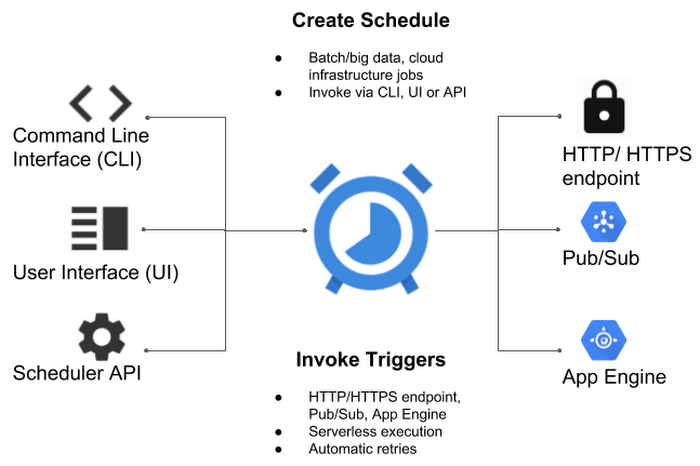
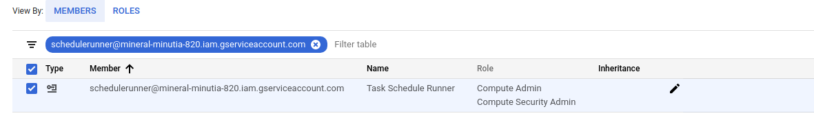
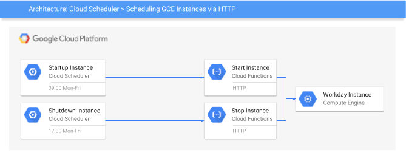
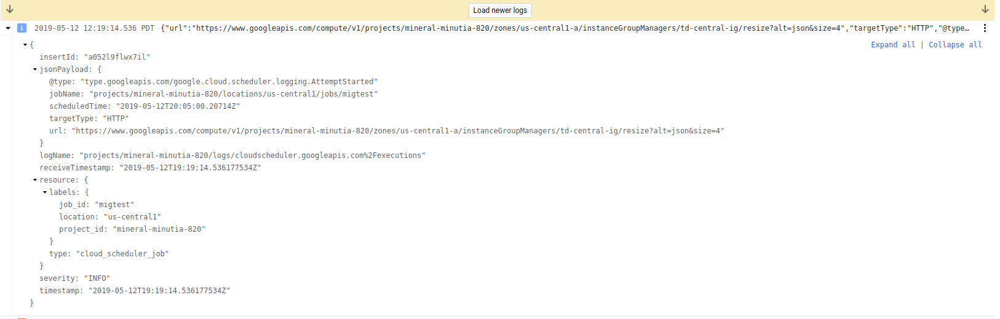
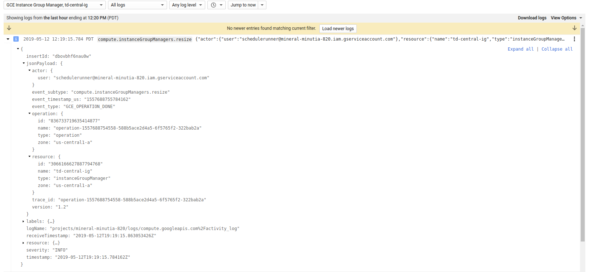

# Automatic oauth2:  Using Cloud Scheduler and Tasks to call Google APIs

A month ago or so I tried out a pretty versatile feature in [Cloud Scheduler](https://cloud.google.com/scheduler/docs/quickstart) and [Cloud Tasks](https://cloud.google.com/tasks/docs/dual-overview) and [Cloud Tasks](https://cloud.google.com/tasks/docs/dual-overview) that emits `OpenIDConnect` or oauth2 `access_token` to outbound webhook calls. When a Scheduled task fires and calls an HTTP endpoint, it can optionally automatically carry credentials for use with a GCP REST Endpoint. What does that mean? Well, you can automatically trigger most Google APIs directly do to any number of things on schedule or as a task instead of creating and running a cron elsewhere. In this article, we will focus on `access_tokens` and some usage cases with examples with `Cloud Scheduler`. A followup article covers `id_tokens`.

Essentially, the `access_token` furnished to Scheduler and Tasks can be used along with a constructed REST payload against GCP services and when you define the Schedule, you specify the REST payload it should send (eg. POST JSON payload for the specific API getting invoked.)

Note: these `access_token` do not by themselves allow access to any GCP resource: you must explicitly allow the identity that the token belows to IAM permissions first.

The two examples covered in this article are relatively trivial but demonstrates its capabilities:

1) Update [Cloud Armor](https://cloud.google.com/armor/) Firewall rule

2) Increase the number of instances in a [Compute Managed Instance Group](https://cloud.google.com/compute/docs/instance-groups/#managed_instance_groups)
    Scheduling tasks like automatically scaling VM instances has been describe many times before. Infact, its in the product documentation [here](https://cloud.google.com/compute/docs/autoscaler/).

Ofcourse these are just two examples and as mentioned, you can use this technique for almost all GCP APIs subject to the caveat described at the end.

This is one in a series where I'll be using various google services to automatically emit credentials.  This article focuses on emitting `oauth2` access token while the followup focuses on `openid connect` tokens.

That is, this article focuses on (A) below, while the second part in the series is (B)

- A) oauth2 `access_tokens`
  - would allow you to directly call a Google Rest API endpoint
  - [https://developers.google.com/identity/protocols/OAuth2](https://developers.google.com/identity/protocols/OAuth2)

- B) Google-issued OpenID Connect `id_tokens`
  - would allow you to call any arbitrary endpoint which accepted an OpenID `id_token` in the payload.
  - [https://openid.net/specs/openid-connect-core-1_0.html#CodeIDToken](https://openid.net/specs/openid-connect-core-1_0.html#CodeIDToken)


For more information about the above two authentication systems, see:

* [Run Containers on GCP's Serverless Infrastructure (Cloud Next '19)](https://youtu.be/xVuuvZkYiNM?t=1546)


## Supported Services

### oauth2 (access_token)

- From Any of:

`[Cloud Scheduler, Cloud Tasks]`

  you can **emit** `access_token`

- to Any of:

`[ GCP REST API endopoint]`

### OIDC (id_token)

- From Any of:

`[Cloud PubSub, Cloud Scheduler, Cloud Tasks]`

  you can **emit** `id_token`

- to Any of:

`[Cloud Run, Cloud Functions, Cloud Enpoints, Istio, {your application} ]`

Specific services like `Cloud Run`, `Cloud Functions` and `Cloud Endpoints` can automatically validate the inbound `id_token` and check if it is properly signed by Google.  Furthermore, you can apply `IAM` policies for the user or service account associated with said token.  In other words, you can construct an IAM policy on `Cloud Run` that states "only allow _this_ service account access where that account is one associated with a `Cloud Scheduler` job.

And as an overview of the sources you can trigger http targets from with Cloud Scheduler:



## Cloud Scheduler

In this section, we will use `Cloud Scheduler` to automatically manipulate the above mentioned GCP APIs and services

First you will need `gcloud` installed and the `beta` apis enabled since the command switches are exposed there currently:

The parameters specific to `oauth2` are:

```bash
gcloud beta scheduler jobs create http ..

        [[--oauth-service-account-email=OAUTH_SERVICE_ACCOUNT_EMAIL
          : --oauth-token-scope=OAUTH_TOKEN_SCOPE]
```

### Create Service Account

First setup a specific service account you wish to scheduler to invoke the endpoint as.  This is the service account that scheduler will run as and acquire the `access_token` for.  The section after this, we will apply IAM policies for this service account.

Note:  Cloud Scheduler by default runs with a service account in the format `service-$PROJECT_NUMBER@gcp-sa-cloudscheduler.iam.gserviceaccount.com`

For other services:

* Cloud Scheduler:  service-$PROJECT_NUMBER@gcp-sa-cloudscheduler.iam.gserviceaccount.com
* Cloud Tasks:  service-$PROJECT_NUMBER@gcp-sa-cloudtasks.iam.gserviceaccount.com


- Setup environment variables
```bash
export PROJECT_ID=`gcloud config get-value core/project`
export PROJECT_NUMBER=`gcloud projects describe $PROJECT_ID --format='value(projectNumber)'`
```

- Create Scheduler Service Account

```bash
gcloud iam service-accounts create schedulerunner --display-name="Task Schedule Runner"

$ gcloud iam service-accounts list
NAME                                      EMAIL                                                                       DISABLED
Task Schedule Runner                      schedulerunner@$PROJECT_ID.iam.gserviceaccount.com                  False
```

- Create a policy file

 (remember to substitute your `PROJECT_NUMBER`)

- `svc_policy.json`:
```json
{
  "bindings": [
    {
      "members": [
        "serviceAccount:service-$PROJECT_NUMBER@gcp-sa-cloudscheduler.iam.gserviceaccount.com"
      ],
      "role": "roles/cloudscheduler.serviceAgent"
    }
  ],
}
```

- Apply Policy file so Scheduler can impersonate

```bash
$ gcloud iam service-accounts set-iam-policy schedulerunner@$PROJECT_ID.iam.gserviceaccount.com  svc_policy.json  -q
```


### Assign IAM Roles to Scheduler to invoke Endpoints

Now to actually use this..This example requires two IAM roles assigned to the acting service account so enable

- `roles/compute.securityAdmin`
- `roles/compute.admin`

on the impersonated account




### Scheulder --> Compute/MIG

The first scenario this tutorial demonstrates is altering the number of instances in a  Managed Instance Group.  This tutorial assumes you've setup a MIG called `td-central-ig`.   

(Yes, i understand, you can already [Autoscale MIG](https://cloud.google.com/compute/docs/autoscaler/))



```bash
$ gcloud compute instance-groups managed list
NAME                          LOCATION       SCOPE   BASE_INSTANCE_NAME            SIZE  TARGET_SIZE  INSTANCE_TEMPLATE                  AUTOSCALED
td-central-ig                 us-central1-a  zone    td-central-ig                 1     1            td-template                        no
```

Altering the number of instances in a MIG is achieved by a REST API call that sets the new `size` via query parameter.

- https://cloud.google.com/compute/docs/reference/rest/v1/instanceGroupManagers/resize

Take a close look at the API you are interested in and use the documentation links provided or the [API Explorer](https://developers.google.com/apis-explorer/#p/) to construct the required call.

In this case, we need an empty `POST` to
```/compute/v1/projects/$PROJECT_ID/zones/us-central1-a/instanceGroupManagers/td-central-ig/resize?alt=json&size=2```

Since this is just a demonstration, we will alter the count every five minutes [`5 * * * *`]  (yes, its unrealistic but you get the idea...).

```bash
gcloud beta scheduler jobs create http migtest  --schedule "5 * * * *" --http-method=POST \
  --uri="https://www.googleapis.com/compute/v1/projects/$PROJECT_ID/zones/us-central1-a/instanceGroupManagers/td-central-ig/resize?alt=json&size=4"  --oauth-service-account-email=schedulerunner@$PROJECT_ID.iam.gserviceaccount.com    \
  --message-body="" \
  --headers=Content-Type=application/json \
  --oauth-token-scope=https://www.googleapis.com/auth/cloud-platform
```

This API returns a `Long Running Operation` (LRO) object which is _NOT_ the final outcome of the API but just a handle.  This means all the Scheduled invocation indicates is that the job was submitted successfully or not..it does not indicate if the MIGs actually scaled up and completed. For more details on this, please see the section on LRO below.

> Note: For security reasons, `access_tokens` will **not** be sent to non google API endpoints.

For the impatient, invoke the scheduled job now

```
gcloud beta scheduler jobs run migtest
```

and check its output in the logs (and ofcourse, view the four new instances)

- Scheduler invocation logs



- MIG logs



### Scheduler --> Cloud Armor

In this section, we will use Scheduler to construct a full `POST` payload that adds an IP address to the list of allowed firewall rules [Cloud Aromor](https://cloud.google.com/armor/docs/) allows.  That is, we will use the

- [securityPolicies/patchRule](https://cloud.google.com/compute/docs/reference/rest/beta/securityPolicies/patchRule) endpoint described here


```json
POST https://www.googleapis.com/compute/beta/projects/$PROJECT_ID/global/securityPolicies/stopcorp/patchRule?priority=1 HTTP/1.1

Authorization: Bearer [YOUR_ACCESS_TOKEN]
Accept: application/json
Content-Type: application/json

{
  "match": {
    "config": {
      "srcIpRanges": [
        "73.162.112.208/32"
      ]
    },
    "versionedExpr": "SRC_IPS_V1"
  }
}
```

In the example above, we're adding a single allowed IP address to the `stopcorp` Cloud Armor allow policy.

Since we need to post data, we'll first construct the parameters in a file:

- Create a file `armor_rule.json` with the specifications

```json
{
  "match": {
    "config": {
      "srcIpRanges": [
        "73.162.112.208/32"
      ]
    },
    "versionedExpr": "SRC_IPS_V1"
  }
}
```

Then specify the parameters in the job

```bash
gcloud beta scheduler jobs create http armortest  --schedule "5 * * * *" --http-method=POST \
  --uri=https://www.googleapis.com/compute/beta/projects/$PROJECT_ID/global/securityPolicies/stopcorp/patchRule?priority=1 \
  --oauth-service-account-email=schedulerunner@$PROJECT_ID.iam.gserviceaccount.com    \
  --message-body-from-file=armor_rule.json \
  --headers=Content-Type=application/json \
  --oauth-token-scope=https://www.googleapis.com/auth/cloud-platform
```

As above, you can view the invocation logs and verify the policy got updated.

## Dynamic Payloads

Certain GCP APIs require dynamic payloads such has uniqueID fields or strings that specify a 'per invocation' setting cannot be specified within a Schedule Job.

For example, the specifications to launch a [Dataflow Job](https://cloud.google.com/dataflow/docs/reference/rest/v1b3/projects.locations.templates/launch) describes a dynamic, unique parameter within the [LaunchTemplate](https://cloud.google.com/dataflow/docs/reference/rest/v1b3/LaunchTemplateParameters):  `jobName`: "The unique name to assign to the job.".  The configuration of Cloud Scheduler does NOT allow for dynamic variables.

The workaround for this is to invoke the dataflow job through Cloud Functions:

- `Cloud Scheduler` --> `Cloud Functions` --> `Dataflow Job`

You can enforce authentication between `Cloud Scheduler` and `Functions` using `id_tokens` while from `Functions` -> `Dataflow` you will need to acquire an `access_token` manually:

The snippet of the code between `GCF` and (in this case), `Cloud Build` looks like:

```python
import google.auth
import google.auth.transport.requests
from google.auth.transport.requests import AuthorizedSession
import requests

def cloudbuild_app_python(request):

    credentials, project = google.auth.default()
    request = google.auth.transport.requests.Request()
    credentials.refresh(request)

    CICD_PROJECT_ID = 'mineral-minutia-820'
    DEPLOY_TO_DEV_TRIGGER_ID = 'd19a0b40-02fd-4b92-a81d-2efb67d1dd9d'

    trigger_run_url = "https://cloudbuild.googleapis.com/v1/projects/{}/triggers/{}:run".format(CICD_PROJECT_ID, DEPLOY_TO_DEV_TRIGGER_ID)

    headers = {
      'Content-Type': 'application/json'
    }

    repo_source = {
        "repoName": "myrep",
        "branchName": "master"
    }

    authed_session = AuthorizedSession(credentials)
    r = authed_session.post(url=trigger_run_url, headers=headers, data=json.dumps(repo_source))

    print(r.status_code)
    print(r.json())

    return str(r.json())
```


## Long Running Operations

Many GCP APIs return `Long Running Operations` which is just a futures handle to poll against.  At the moment (3/12/19), Cloud Scheduler does NOT process these LROs (and neither does `Cloud Tasks`).  What you end up with is just an indication that the task or job started; not its final outcome.  If you are interested in the final outcome as a signal back to the success/failure of the Task itself, you need to make the Scheduler invoke a Cloud Function which inturn does the handling of the LRO.

That is,

`Cloud Scheduler` --> `Cloud Function` --> `GCP API with LRO`

Your cloud function will process the LRO and return success/failure back to Scheduler.  You can secure this entire pipeline with authentication too as described in the followup article about `Automatic OIDC`.

- `Cloud Scheduler` --> `Cloud Function`:  use `OIDC` authentication
- `Cloud Function` --> `GCP API`: use `oauth2` access_tokens

Please be aware the maximum duration a Scheduled job can run as well as the retry behavior `Cloud Tasks` and `Cloud Scheduler` has.

If you want to manually process the operations, see
- [LRO Polling Operations](https://cloud.google.com/compute/docs/api/how-tos/api-requests-responses#polling_operations)
- [google-cloud-core Operations](https://google-cloud.readthedocs.io/en/latest/core/operation.html)
- [LRO example with GCF](https://github.com/GoogleCloudPlatform/nodejs-docs-samples/blob/master/functions/scheduleinstance/index.js#L46)
