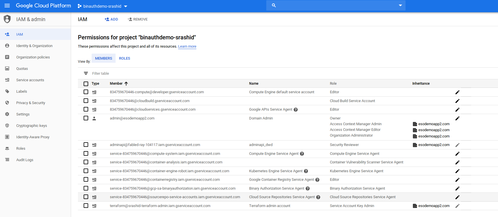
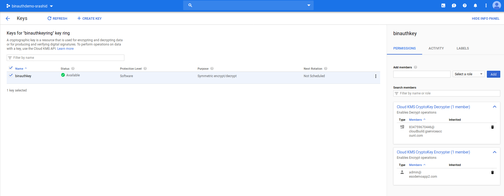
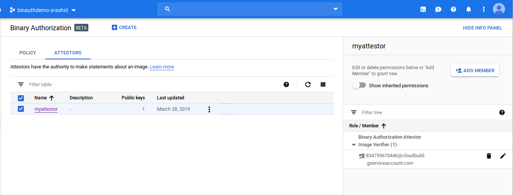
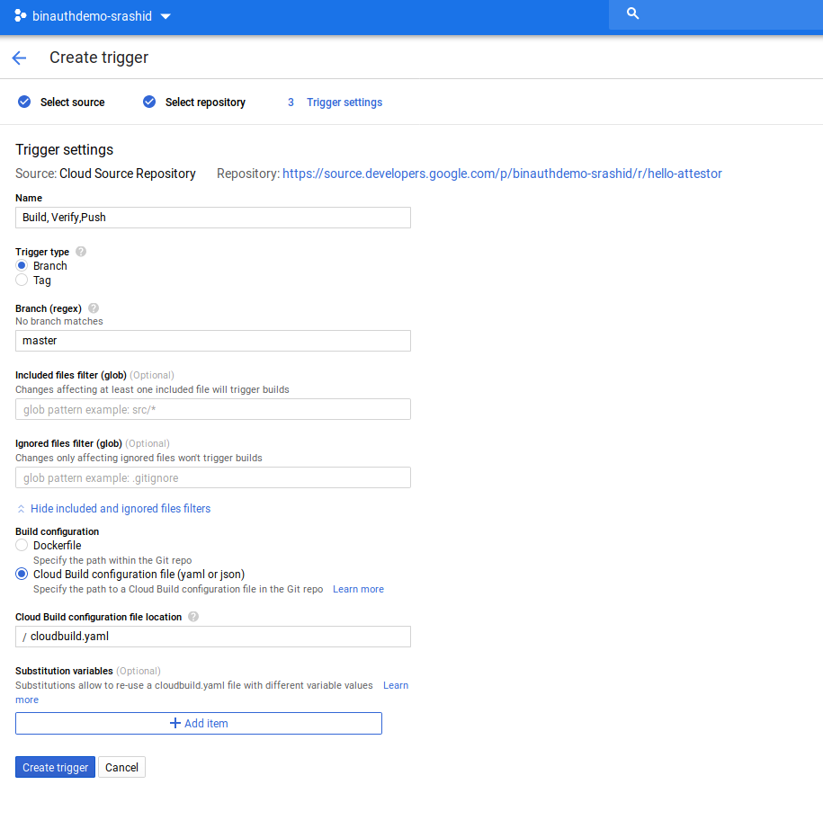
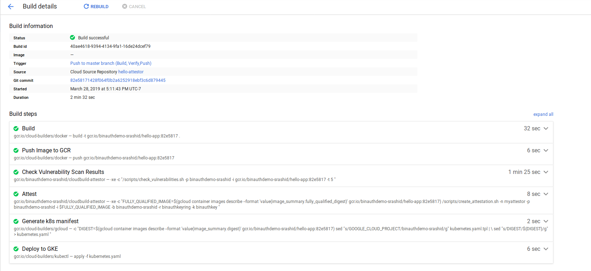
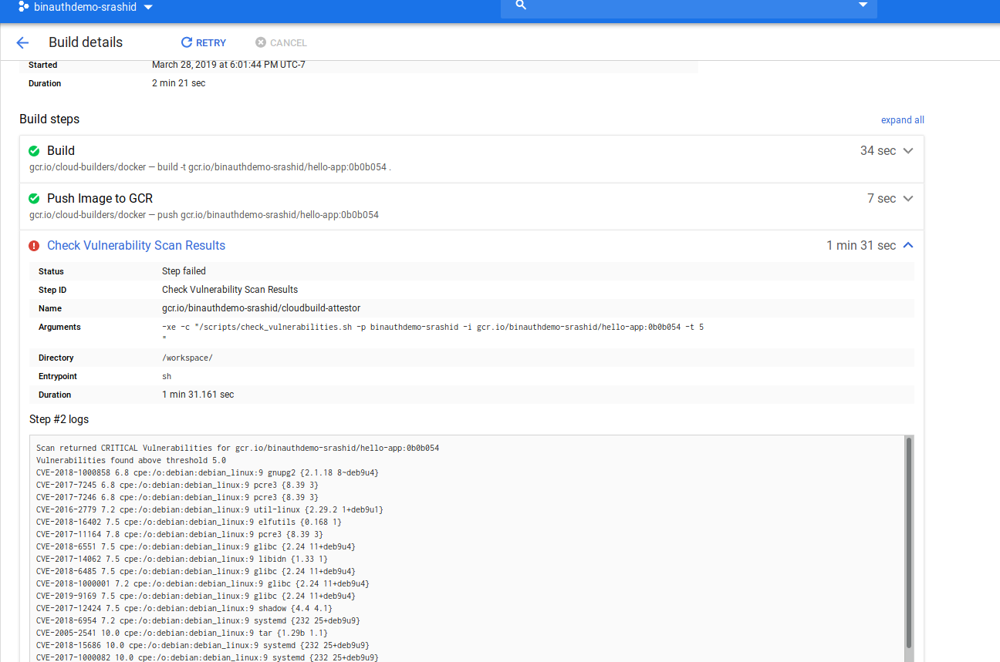
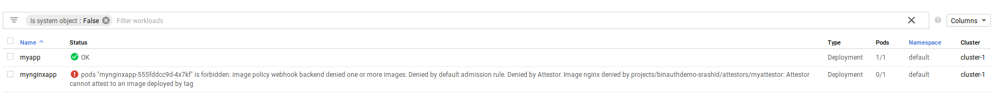

# GCP Binary Authorization and Vulnerability Scanning Demo

Sample application for GCP Binary Authorization + Vulernability Scanner.  

- Creates GKE cluster with Binary Authorization
- Enables Binary Authoriztion policy on cluster
- Cloud Builder workflow checks checked in code to Cloud Source repository
  - Builds container image and pushes to Cloud Container Registry
  - Binary Auhorization step waits for Vulernability Scan to complete
  - If Vulernability Scanner Fails, Deployment Fails
  - If Succeeds, the imae is authorized for deployment to GKE

> Note: this sample uses *one* cloud builder configuration to both build the image _and_ do attestation.  Normally, these functions are on separate but dependent workflows to prevent users that write and submit cloudbuild configrations from accessing attestors secrets (eg, run attestation from a cloud builder step in a separate project).  You can also setup external attestation which would address this issue.

## Setup

### Create Project

```bash
export PROJECT=binauthdemo-$USER
export ZONE=us-central1-a

gcloud config set compute/zone $ZONE
gcloud projects create $PROJECT --name $PROJECT

PROJECT_NUMBER="$(gcloud projects describe $PROJECT --format='get(projectNumber)')"


gcloud auth application-default login

(associate project to billing account)
```

### Enable APIs


```bash
gcloud services enable binaryauthorization.googleapis.com  cloudbuild.googleapis.com   cloudkms.googleapis.com  compute.googleapis.com   container.googleapis.com  containeranalysis.googleapis.com  containerregistry.googleapis.com   sourcerepo.googleapis.com

$ gcloud services list
NAME                                TITLE
bigquery-json.googleapis.com        BigQuery API
binaryauthorization.googleapis.com  Binary Authorization API
cloudapis.googleapis.com            Google Cloud APIs
cloudbuild.googleapis.com           Cloud Build API
clouddebugger.googleapis.com        Stackdriver Debugger API
cloudkms.googleapis.com             Cloud Key Management Service (KMS) API
cloudtrace.googleapis.com           Stackdriver Trace API
compute.googleapis.com              Compute Engine API
container.googleapis.com            Kubernetes Engine API
containeranalysis.googleapis.com    Container Analysis API
containerregistry.googleapis.com    Container Registry API
datastore.googleapis.com            Cloud Datastore API
iam.googleapis.com                  Identity and Access Management (IAM) API
iamcredentials.googleapis.com       IAM Service Account Credentials API
logging.googleapis.com              Stackdriver Logging API
monitoring.googleapis.com           Stackdriver Monitoring API
oslogin.googleapis.com              Cloud OS Login API
pubsub.googleapis.com               Cloud Pub/Sub API
servicemanagement.googleapis.com    Service Management API
serviceusage.googleapis.com         Service Usage API
sourcerepo.googleapis.com           Cloud Source Repositories API
sql-component.googleapis.com        Cloud SQL
storage-api.googleapis.com          Google Cloud Storage JSON API
storage-component.googleapis.com    Cloud Storage
```

### Export ServiceAccount names

```bash
export CLOUD_BUILD_SERVICE_ACCOUNT=$PROJECT_NUMBER@cloudbuild.gserviceaccount.com 
```



### Create GKE Cluster

```bash
export GKE_CLUSTER=cluster-1

gcloud beta container  clusters create $GKE_CLUSTER --machine-type "n1-standard-1" --zone $ZONE  --num-nodes 2  --enable-binauthz
```

- Allow CloudBuilder Access to Deploy to GKE

```bash
gcloud projects add-iam-policy-binding ${PROJECT} \
    --member=serviceAccount:${CLOUD_BUILD_SERVICE_ACCOUNT} \
    --role=roles/container.developer
```

### Create GCS Bucket for Secrets

```bash
export GCS_BUCKET=binauthdemo-$USER

gsutil mb gs://$GCS_BUCKET
```

### Create GPG keypair

```bash
export ATTESTOR_NAME=myattestor
```

- Create keypair

```
$ gpg --full-generate-key
```
  - RSA and RSA; 4096bits; keys do not expire
  - name: GCP_Attestor
  - email: gcpattestor@domain.com
  - password: password

- Export Public/Private Keys

```bash
gpg --armor --export gcpattestor@domain.com > certs/$ATTESTOR_NAME.asc
gpg --export-secret-keys gcpattestor@domain.com > certs/$ATTESTOR_NAME.gpg
echo "password" > certs/$ATTESTOR_NAME.pass
```


- Export Fingerprint

For example
```bash
gpg --list-secret-keys
    sec   rsa4096 2019-03-28 [SC]
        62851DE231E5D7519E58BAE3F6B283180B15EBB7
    uid           [ultimate] GCP_Attestor <gcpattestor@domain.com>
    ssb   rsa4096 2019-03-28 [E]


echo "62851DE231E5D7519E58BAE3F6B283180B15EBB7" > certs/$ATTESTOR_NAME.fpr
```

### Copy Keys to GCS and change Permissions

```bash
gsutil iam ch serviceAccount:$CLOUD_BUILD_SERVICE_ACCOUNT:objectViewer gs://$GCS_BUCKET
```

### Create KMS key and assign Permissions

```bash
export KMS_KEYRING=binauthkeyring
export KMS_KEY=binauthkey

gcloud kms keyrings create $KMS_KEYRING  --location global
gcloud kms keys create $KMS_KEY --location=global --purpose=encryption --keyring=$KMS_KEYRING
```

- Allow Cloud Builder access to decrypt

```bash
gcloud kms keys add-iam-policy-binding $KMS_KEY --keyring $KMS_KEYRING --location global --member=serviceAccount:$CLOUD_BUILD_SERVICE_ACCOUNT --role='roles/cloudkms.cryptoKeyDecrypter'
```

- Allow current user to initially encrypt secrets

```bash
gcloud kms keys add-iam-policy-binding $KMS_KEY --keyring $KMS_KEYRING --location global --member=user:$(gcloud config get-value core/account) --role='roles/cloudkms.cryptoKeyEncrypter'
```



### Encrypt Attestation Private Key and Passphrase

```bash
gcloud kms encrypt --plaintext-file=certs/$ATTESTOR_NAME.gpg --ciphertext-file=certs/$ATTESTOR_NAME.gpg.enc  --key=$KMS_KEY --keyring=$KMS_KEYRING --location=global
gcloud kms encrypt --plaintext-file=certs/$ATTESTOR_NAME.pass --ciphertext-file=certs/$ATTESTOR_NAME.pass.enc  --key=$KMS_KEY --keyring=$KMS_KEYRING --location=global
```

### Upload Encrypted Key, Passphrase and Fingerprint

```bash
gsutil cp certs/$ATTESTOR_NAME.gpg.enc gs://$GCS_BUCKET/
gsutil cp certs/$ATTESTOR_NAME.pass.enc gs://$GCS_BUCKET/
gsutil cp certs/$ATTESTOR_NAME.fpr gs://$GCS_BUCKET/
gsutil cp certs/$ATTESTOR_NAME.asc gs://$GCS_BUCKET/
```


## Configure Attestation

### Create Note

```bash
export NOTE_ID=myattestor

cat > /tmp/note_payload.json << EOM
{
  "name": "projects/${PROJECT}/notes/${NOTE_ID}",
  "attestation_authority": {
    "hint": {
      "human_readable_name": "${PROJECT}-${NOTE_ID}"
    }
  }
}
EOM
```

```bash
curl -X POST \
    -H "Content-Type: application/json" \
    -H "Authorization: Bearer $(gcloud auth print-access-token)"  \
    --data-binary @/tmp/note_payload.json  \
    "https://containeranalysis.googleapis.com/v1beta1/projects/${PROJECT}/notes/?noteId=${NOTE_ID}"
```

Verify:
```bash
curl \
    -H "Authorization: Bearer $(gcloud auth print-access-token)"  \
    "https://containeranalysis.googleapis.com/v1beta1/projects/${PROJECT}/notes/"
```

### Set IAM Permissions

- `roles/containeranalysis.notes.occurrences.viewer`
- `roles/containeranalysis.notes.attacher`

```bash
export NOTE_ID=myattestor

cat > /tmp/iam_request.json << EOM
{
  'resource': 'projects/${PROJECT}/notes/${NOTE_ID}',
  'policy': {
    'bindings': [
      {
        'role': 'roles/containeranalysis.notes.occurrences.viewer',
        'members': [
          'serviceAccount:${CLOUD_BUILD_SERVICE_ACCOUNT}'
        ]
      },
      {
        'role': 'roles/containeranalysis.notes.attacher',
        'members': [
          'serviceAccount:${CLOUD_BUILD_SERVICE_ACCOUNT}'
        ]
      }      
    ]
  }
}
EOM
```

```bash
curl -X POST  \
    -H "Content-Type: application/json" \
    -H "Authorization: Bearer $(gcloud auth print-access-token)" \
    --data-binary @/tmp/iam_request.json \
    "https://containeranalysis.googleapis.com/v1beta1/projects/${PROJECT}/notes/${NOTE_ID}:setIamPolicy"
```

### Create Attestation

```bash
gcloud --project="${PROJECT}" \
    beta container binauthz attestors create "${ATTESTOR_NAME}" \
    --attestation-authority-note="${NOTE_ID}" \
    --attestation-authority-note-project="${PROJECT}"


gcloud beta container binauthz attestors add-iam-policy-binding \
  "projects/${PROJECT}/attestors/${ATTESTOR_NAME}" \
  --member="serviceAccount:${CLOUD_BUILD_SERVICE_ACCOUNT}" \
  --role=roles/binaryauthorization.attestorsVerifier

gcloud --project="${PROJECT}" \
    beta container binauthz attestors public-keys add \
    --attestor="${ATTESTOR_NAME}" \
    --public-key-file=certs/${ATTESTOR_NAME}.asc
```




## Deploy Vulnerability Scanner Image

```bash
docker build gcr.io/${PROJECT}/cloudbuild-attestor src/attestor/

gcloud docker -- push gcr.io/${PROJECT}/cloudbuild-attestor
```

Acquire the image Hash
```bash
gcloud docker -- inspect  gcr.io/${PROJECT}/cloudbuild-attestor  --format='{{.Id}}'
   eg: sha256:b904e0c37b57e310a16a63662f2b9480aba35599883a498ca184aa6aa25b9ccd
```

## Create Application

### Create Source Repo
```bash
export REPO_NAME=hello-attestor

mkdir deployer/
gcloud source repos create $REPO_NAME
gcloud source repos clone $REPO_NAME .

git remote add google https://source.developers.google.com/p/$PROJECT/r/$REPO_NAME
```


### Copy Application Source and Configure

```bash
cp -R ../src/app/* .
```

- Edit `cloudbuild.yaml`

Change the `NOTE_ID`, `ZONE`, `KMS_KEYRING`, `KMS_KEY` and `CLUTER_NAME`:  Change these values with the ones in current env:

```
echo $NOTE_ID
echo $ZONE
echo $KMS_KEYRING
echo $KMS_KEY
echo $CLUSTER_NAME
```

```yaml

   /scripts/create_attestation.sh -n NOTE_ID -p $PROJECT_ID -i $$FULLY_QUALIFIED_IMAGE -b BUCKET_NAME -r KMS_KEYRING  -k KMS_KEY
...
  env:
  - 'CLOUDSDK_COMPUTE_ZONE=ZONE'
  - 'CLOUDSDK_CONTAINER_CLUSTER=CLUSTER_NAME'
```

If using defaults:

```yaml

   /scripts/create_attestation.sh -n myattestor -p $PROJECT_ID -i $$FULLY_QUALIFIED_IMAGE -b binauthdemo-`whoami` -r binauthkeyring  -k binauthkey 
...
  env:
  - 'CLOUDSDK_COMPUTE_ZONE=us-central1-a'
  - 'CLOUDSDK_CONTAINER_CLUSTER=cluster-1'
```

### Create Build Trigger

- Cloud Console >> Container Builder
  - Create Trigger:  
    - 'Cloud Source Repository'
    - select set value for $REPO_NAME
    - Name: "Build, Verify,Push"
    - Trigger Type: Branch (regex: master)
    - Cloud Build Configuration File `cloudbuild.yaml`

    


## Push Application

The following will build an push an application with the imageName:  `gcr.io/${PROJECT}/hello-app`

```bash

git add -A && git commit -m "commit (`date`)" && git push google master
```
- View Build Progress



## Verify Service

```bash
$ kubectl get po,svc,deployment
NAME                         READY     STATUS    RESTARTS   AGE
pod/myapp-6fb976d8cc-zrctx   1/1       Running   0          3m

NAME                        TYPE           CLUSTER-IP     EXTERNAL-IP    PORT(S)        AGE
service/hello-app-service   LoadBalancer   10.11.249.32   35.222.0.110   80:30909/TCP   10m
service/kubernetes          ClusterIP      10.11.240.1    <none>         443/TCP        4h

NAME                          DESIRED   CURRENT   UP-TO-DATE   AVAILABLE   AGE
deployment.extensions/myapp   1         1         1            1           3m

$ curl http://35.222.0.110/
Hello World!
```

# Verify Deployment Failure for vuleranable images

Change the base image from `alpine` to `debain`.  This will cause the pipeline to fail since the number of CVE findings will exceed
the allocated threshold in `check_vulnerabilities.sh -p $PROJECT_ID -i gcr.io/$PROJECT_ID/hello-app:$SHORT_SHA -t 5`
(default level: `5`)

- edit `deployment/Docker
```
#FROM alpine
FROM debian
```

Push
```
git add -A && git commit -m "commit (`date`)" && git push google master
```

Check Failure:

```
Scan returned CRITICAL Vulnerabilities for gcr.io/binauthdemo-srashid/hello-app:0b0b054
Vulnerabilities found above threshold 5.0
CVE-2018-1000858	6.8	cpe:/o:debian:debian_linux:9	gnupg2	{2.1.18 8~deb9u4}
CVE-2017-7245	6.8	cpe:/o:debian:debian_linux:9	pcre3	{8.39 3}
CVE-2017-7246	6.8	cpe:/o:debian:debian_linux:9	pcre3	{8.39 3}
CVE-2016-2779	7.2	cpe:/o:debian:debian_linux:9	util-linux	{2.29.2 1+deb9u1}
CVE-2018-16402	7.5	cpe:/o:debian:debian_linux:9	elfutils	{0.168 1}
CVE-2017-11164	7.8	cpe:/o:debian:debian_linux:9	pcre3	{8.39 3}
```




## Enable Binary Authorization

Enable Binary Authorization on this cluster by setting a [Policy](https://cloud.google.com/binary-authorization/docs/configuring-policy-cli#overview)

```
gcloud beta container binauthz policy export  > /tmp/policy.yaml
```

- edit `/tmp/policy` 

and replace with the default config to enforce as shown in the link above

eg:  

```
echo $PROJECT
echo $ATTESTOR_NAME
```

```yaml
...
defaultAdmissionRule:
  evaluationMode: REQUIRE_ATTESTATION
  enforcementMode: ENFORCED_BLOCK_AND_AUDIT_LOG
  requireAttestationsBy:
  - projects/PROJECT/attestors/ATTESTOR_NAME
...
```

```bash
$ gcloud beta container binauthz policy import /tmp/policy.yaml
```

## Attempt to deploy arbitrary container

```
$ kubectl run --image=nginx mynginxapp
deployment.apps/mynginxapp created
```

Deployment is created but the Workload shows:

```
pods "mynginxapp-555fddcc9d-4x7kf" is forbidden: image policy webhook backend denied one or more images: Denied by default admission rule. Denied by Attestor. Image nginx denied by projects/binauthdemo-srashid/attestors/myattestor: Attestor cannot attest to an image deployed by tag 
```



## Deploy Attested Container

- edit `deploy/src/main.go` and upate `Hello World` --> `Hello World!!!!`

- Redploy

```bash
git add -A && git commit -m "commit (`date`)" && git push google master
$ git add -A && git commit -m "commit (`date`)" && git push google master
[master de438e4] commit (Thu Mar 28 17:40:30 PDT 2019)
To https://source.developers.google.com/p/binauthdemo-srashid/r/hello-attestor
   82e5817..de438e4  master -> master
```
- Output

```
DONE
PUSH
Finished Step #5 - "Deploy to GKE"
Step #5 - "Deploy to GKE": service/hello-app-service unchanged
Step #5 - "Deploy to GKE": deployment.apps/myapp configured
Step #5 - "Deploy to GKE": Running: kubectl apply -f kubernetes.yaml
Step #5 - "Deploy to GKE": kubeconfig entry generated for cluster-1.
Step #5 - "Deploy to GKE": Fetching cluster endpoint and auth data.
Step #5 - "Deploy to GKE": Running: gcloud container clusters get-credentials --project="binauthdemo-srashid" --zone="us-central1-a" "cluster-1"
Step #5 - "Deploy to GKE": Already have image (with digest): gcr.io/cloud-builders/kubectl
Starting Step #5 - "Deploy to GKE"
Finished Step #4 - "Generate k8s manifest"
Step #4 - "Generate k8s manifest": Already have image (with digest): gcr.io/cloud-builders/gcloud
Starting Step #4 - "Generate k8s manifest"
Finished Step #3 - "Attest"
Step #3 - "Attest": + gcloud beta container binauthz attestations create --artifact-url=gcr.io/binauthdemo-srashid/hello-app@sha256:da9eda4adcd09b5ef9ae99369c13b06ba77247f8f4ab5bf4b47889a58c5e87d8 --attestor=projects/binauthdemo-srashid/attestors/myattestor --signature-file=generated_signature.pgp --pgp-key-fingerprint=62851DE231E5D7519E58BAE3F6B283180B15EBB7
Step #3 - "Attest": ++ cat myattestor.fpr
Step #3 - "Attest": + gpg2 --no-tty --pinentry-mode loopback --passphrase-file myattestor.pass --output generated_signature.pgp --armor --sign generated_payload.json
Step #3 - "Attest": gpg:   secret keys imported: 2
Step #3 - "Attest": gpg:       secret keys read: 3
```

- Verify Attestion for Image:

```
gcr.io/binauthdemo-srashid/hello-app@sha256:da9eda4adcd09b5ef9ae99369c13b06ba77247f8f4ab5bf4b47889a58c5e87d8
```

```
gcloud beta container binauthz attestations list --artifact-url=gcr.io/binauthdemo-srashid/hello-app@sha256:da9eda4adcd09b5ef9ae99369c13b06ba77247f8f4ab5bf4b47889a58c5e87d8 --attestor=projects/binauthdemo-srashid/attestors/myattestor
PGP_KEY_ID                                ARTIFACT_URL
62851DE231E5D7519E58BAE3F6B283180B15EBB7  https://gcr.io/binauthdemo-srashid/hello-app@sha256:da9eda4adcd09b5ef9ae99369c13b06ba77247f8f4ab5bf4b47889a58c5e87d8
```

## Verify Attested Container

```bash
$ kubectl get po,svc,deployment
NAME                         READY     STATUS    RESTARTS   AGE
pod/myapp-56f85dc886-fg6sw   1/1       Running   0          2m <<<<<<<<<<<<<<<
 
NAME                        TYPE           CLUSTER-IP     EXTERNAL-IP    PORT(S)        AGE
service/hello-app-service   LoadBalancer   10.11.249.32   35.222.0.110   80:30909/TCP   43m
service/kubernetes          ClusterIP      10.11.240.1    <none>         443/TCP        4h

NAME                               DESIRED   CURRENT   UP-TO-DATE   AVAILABLE   AGE
deployment.extensions/myapp        1         1         1            1           36m
deployment.extensions/mynginxapp   1         0         0            0           15m


$curl http://35.222.0.110/
Hello World!!!!
```


## Cleanup

Delete project

```bash
gcloud projects delete $PROJECT
```


# References

- https://cloud.google.com/binary-authorization/docs/quickstart
- https://cloud.google.com/cloud-build/docs/configuring-builds/substitute-variable-values
- https://cloud.google.com/solutions/secure-software-supply-chains-on-google-kubernetes-engine
- https://www.youtube.com/watch?v=O2YRS9i8O60&feature=youtu.be&t=902\
- https://cloud.google.com/binary-authorization/docs/creating-attestors
