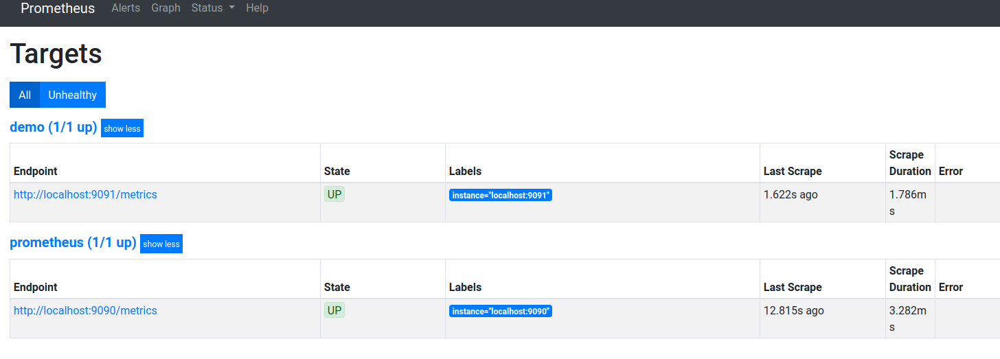
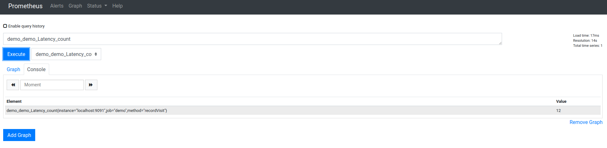
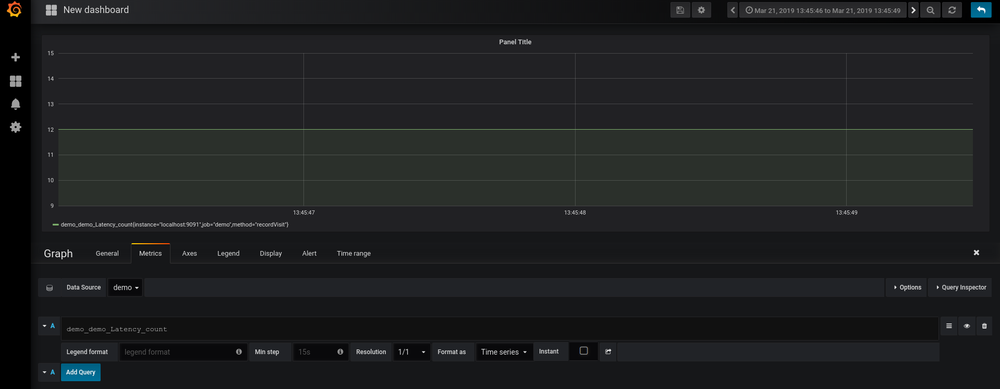
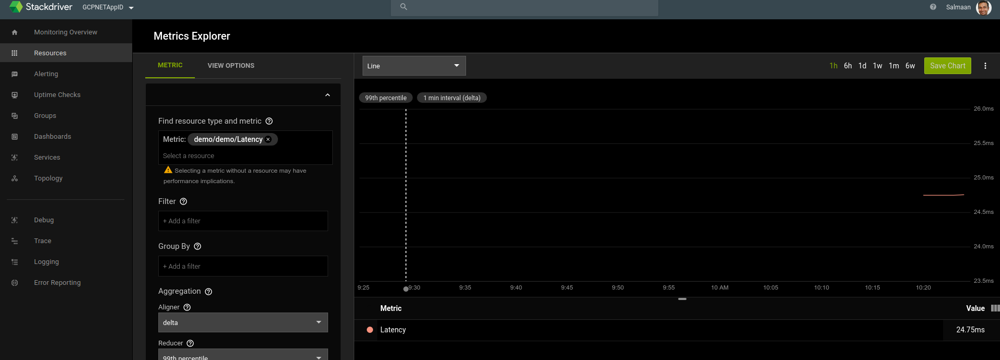
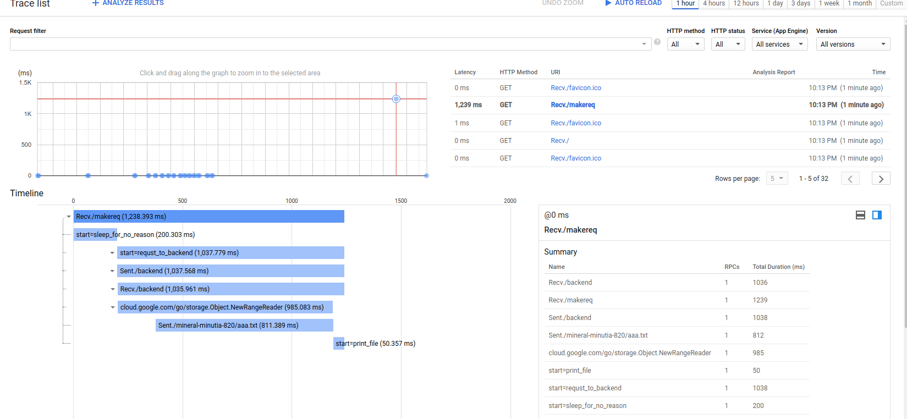
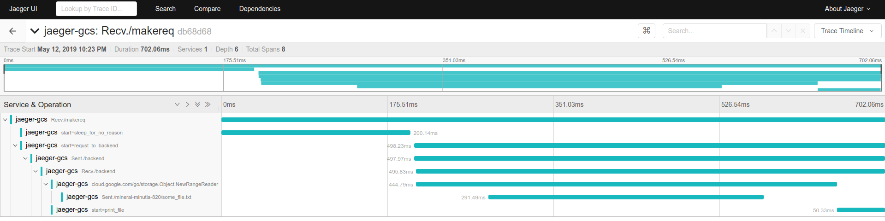

# Google Cloud Trace context propagation and metrics graphs with Grafana+Prometheus and Stackdriver

Sample _stand alone_ app that uses opencensus to emit metrics and traces.  Also demonstrates how 'distributed' traces work with
Google Cloud APIs and between webrequests.

This is really just a basic 'hello world' in golang showing how to integrate a webapp with opencensus.

Specifially, this app shows how to use [Opencensus](https://opencensus.io/) to track latency in a golang-app.

Each request that comes in goes through middleware that handles the latency metrics collection and emission:

- For Metrics:
   - Tracks http latency for a web request handler using middleware
   - sends latency statistics to both promethus and stackdriver
   - view/graph metrics with grafana
   - view/graph metrics with stackdriver

In addition to latency for request, the sample exposes endpoints that demonstrates Trace propagation between requests and with GCP libraries:

- For Traces
   - Tracks trace propagation between a simulated 'frontend' and 'backend' http service within the app:
     - An inbound request to `/makereq` endpoint displays custom spans as well makes a *new* http request to the `/backend` endpoint
     - Trace data emitted displays the spans within `/makereq` and also shows details of what happened within `/backend`
   - Displays trace details of GCP API requests (i.,e what happned _within_ the request to retrive a file, for example)
     - An inbound request to `/backend` will start custom spans and use `google-cloud-storage` golang library to retrive a file
   - Sends traces to both Jaeger and Stackdriver

The code smaple combines both but you can split up the tracing and monitoring components.

## Components involved

- Opencensus
- Prometheus
- Grafana
- Stackdriver
- Cloud Trace
- Jaeger

# Setup

The setup involves setting up everything locally so the install covers everything from scratch:

## Prometheus

1. [Download prometheus](https://prometheus.io/download/)

2. Add target to monitor for promethus
   In the following, prometheus will interrogate the golang application on port `:9091/metrics` for stats

`prometheus.yml`:
```yaml
scrape_configs:
  - job_name: 'demo'
    static_configs:
    - targets: ['localhost:9091']
```

3. Start Promethus

```
$ ./prometheus 
```

4. Access Promethus Dashboard
 - [http://localhost:9090/graph](http://localhost:9090/graph)


## Grafana

1. [Install Grafana](https://grafana.com/grafana/download)

2. Start grafana web interface

```
./bin/grafana-server web
```

3. Access UI interface:

  - http://localhost:3000/login
  
  - Username/password: admin/admin


4. Create a [Datasource](http://docs.grafana.org/features/datasources/) called  "demo" and point it to promethus `http://localhost:9090/`
   Verify the connectivity works

5. Create a Dashboard and Graph
    (do this step after sending some metrics in so the values scraped/provided by promethus shows up)
   - Note: setting up a graph in Grapfana isn't intuitive; you've got to setup a dashboard-graph, and within the graph select the 'Edit' dropdown..

# Jaeger

Download and start container image for `Jaeger`
```
docker run \
--interactive \
--tty \
--publish=16686:16686 \
--publish=14268:14268 \
jaegertracing/all-in-one:latest
```

- Access WebUI:
```
http://localhost:16686/
```

# Download GCP Service Account JSON key file 
  This is only used by Cloud Trace and Stackdriver Metrics; Promethus and Grafana will ofcourse work without it.

  Make sure the service account has  `Monitoring Metric Writer`, `Cloud Trace Agent` IAM permissions

# Start app

```
export GOOGLE_APPLICATION_CREDENTIALS=/path/to/svc.json
```

Export env var defining your google cloud project:

```
$ export GOOGLE_CLOUD_PROJECT=your_project_id
```

Upload a sample file to the default GCS Bucket for the project
(we will read this file in from the app later)
```
$ echo "fooo" > some_file.txt
$ gsutil cp some_file.txt gs://$GOOGLE_CLOUD_PROJECT/
```

- Run App
```
$ go run main.go 
```

Access your app at these two endpoints
- http://localhost:8080/
  - Endpoint just displays the environment variables
  - Opencensus handlers are invoked to track the latency measures
  
- http://localhost:8080/makereq
  - Endpoint makes an ountbound HTTP call to `/backend` endpoint on the same application
  - The trace context from `/makereq` is transferred under a span to `/backend`
  - `/backend` takes the trace context, then makes a GCS API call to recall a file `some_file.txt`


# View Metrics

In both endpoints, you should see statstics emitted by opencensus on the promethus scrapers endpoint:

- http://localhost:9091/metrics

You should see something like this after 30s

```
# HELP demo_demo_Latency The distribution of latencies
# TYPE demo_demo_Latency histogram
demo_demo_Latency_bucket{method="recordVisit",le="25"} 0
demo_demo_Latency_bucket{method="recordVisit",le="50"} 11
demo_demo_Latency_bucket{method="recordVisit",le="100"} 11
demo_demo_Latency_bucket{method="recordVisit",le="250"} 11
demo_demo_Latency_bucket{method="recordVisit",le="500"} 11
demo_demo_Latency_bucket{method="recordVisit",le="1000"} 11
demo_demo_Latency_bucket{method="recordVisit",le="2500"} 12
demo_demo_Latency_bucket{method="recordVisit",le="5000"} 12
demo_demo_Latency_bucket{method="recordVisit",le="+Inf"} 12
demo_demo_Latency_sum{method="recordVisit"} 615.0219909999998
demo_demo_Latency_count{method="recordVisit"} 12
```


## Prometheus

Verify Promethus scrpe targets are valid/ok




Ask promethus to display the metric set, in our case, we're emitting
`demo_demo_Latency_count`




## Grafana

Grafana will read in the promethus collected stats and display them in a chart for the
`demo` datasource under `demo_demo_Latency_count`:




## Stackdriver

Stackdriver should also display the same data emitted by opencensus:

- https://cloud.google.com/monitoring/custom-metrics/open-census#oc-in-sd




The metric we emitted translates to:

```custom.googleapis.com/opencensus/demo/Latency```

```yaml
  {
   "name": "projects/mineral-minutia-820/metricDescriptors/custom.googleapis.com/opencensus/demo/Latency",
   "labels": [
    {
     "key": "method"
    },
    {
     "key": "opencensus_task",
     "description": "Opencensus task identifier"
    }
   ],
   "metricKind": "CUMULATIVE",
   "valueType": "DISTRIBUTION",
   "unit": "ms",
   "description": "The distribution of latencies",
   "displayName": "demo/demo/Latency",
   "type": "custom.googleapis.com/opencensus/demo/Latency"
  },
```

An actual metric datapoint for this distribution type looks like

```json
{
 "timeSeries": [
  {
   "metric": {
    "labels": {
     "method": "recordVisit",
     "opencensus_task": "go-64976@srashid3"
    },
    "type": "custom.googleapis.com/opencensus/demo/Latency"
   },
   "resource": {
    "type": "global",
    "labels": {
     "project_id": "mineral-minutia-820"
    }
   },
   "metricKind": "CUMULATIVE",
   "valueType": "DISTRIBUTION",
   "points": [
    {
     "interval": {
      "startTime": "2019-03-22T17:19:04.534761Z",
      "endTime": "2019-03-22T17:28:04.534826Z"
     },
     "value": {
      "distributionValue": {
       "count": "97",
       "mean": 0.09148156701030928,
       "sumOfSquaredDeviation": 0.1044109482538145,
       "bucketOptions": {
        "explicitBuckets": {
         "bounds": [
          0,
          25,
          50,
          100,
          250,
          500,
          1000,
          2500,
          5000
         ]
        }
       },
       "bucketCounts": [
        "0",
        "97"
       ]
      }
     }
    },
    {
```

# Tracing

Finally, the trace context is propagated from `/makereq` --> `/backend` --> `GCS`

So what you should see is the full trace in stackdriver like this:



in Jaeger console



WHat makes this possible is transferring the golang context forward:
 ```https://github.com/GoogleCloudPlatform/golang-samples/blob/master/trace/trace_quickstart/main.go#L51```

 
 for example, in 

 - `/makereq`:

 ```golang
 func makereq(resp http.ResponseWriter, req *http.Request) {

	client := &http.Client{Transport: &ochttp.Transport{}}

	// start span
	c, sleepSpan := trace.StartSpan(req.Context(), "start=sleep_for_no_reason")
	time.Sleep(200 * time.Millisecond)
	sleepSpan.End()
	// end span

	// Start span
	c, span := trace.StartSpan(req.Context(), "start=requst_to_backend")

	hreq, _ := http.NewRequest("GET", "http://localhost:8080/backend", nil)
	// add context to outbound http request
	hreq = hreq.WithContext(c)
	rr, err := client.Do(hreq)
	if err != nil {
		log.Printf("Unable to print file contentt: %v", err)
		http.Error(resp, http.StatusText(http.StatusInternalServerError), http.StatusInternalServerError)
	}
	fmt.Fprintf(resp, "%s \n", rr.Status)
	rr.Body.Close()
	span.End()
	// end Span
}
 ```


 - `/backend`

 ```golang
 func backend(resp http.ResponseWriter, req *http.Request) {

	// Acquire inbound context
	ctx := req.Context()

	tokenSource, err := google.DefaultTokenSource(oauth2.NoContext, storage.ScopeReadOnly)
	if err != nil {
		log.Printf("Unable to acquire token source: %v", err)
		http.Error(resp, http.StatusText(http.StatusInternalServerError), http.StatusInternalServerError)
	}

	// Make GCS api request
	storeageCient, err := storage.NewClient(ctx, option.WithTokenSource(tokenSource))
	if err != nil {
		log.Printf("Unable to acquire storage Client: %v", err)
		http.Error(resp, http.StatusText(http.StatusInternalServerError), http.StatusInternalServerError)
	}

	bkt := storeageCient.Bucket(os.Getenv("GOOGLE_CLOUD_PROJECT"))			
	obj := bkt.Object("some_file.txt")

	//r, err := obj.NewReader(context.Background())
	r, err := obj.NewReader(ctx)
	if err != nil {
		log.Printf("Unable to read filest: %v", err)
		http.Error(resp, http.StatusText(http.StatusInternalServerError), http.StatusInternalServerError)
	}
	defer r.Close()
	
	// End GCS API call

	// Start Span
	_, fileSpan := trace.StartSpan(ctx, "start=print_file")
	if _, err := io.Copy(os.Stdout, r); err != nil {
		log.Printf("Unable to print file contentt: %v", err)
		http.Error(resp, http.StatusText(http.StatusInternalServerError), http.StatusInternalServerError)
	}
	time.Sleep(50 * time.Millisecond)
	fileSpan.End()
	// End Span

	fmt.Fprintf(resp, "backend")
}

 ```

 Notice the request context is reacquired and passed into theoutbound request with opencensus client:

 ```golang
client := &http.Client{Transport: &ochttp.Transport{}}
hreq, _ := http.NewRequest("GET", "http://localhost:8080/backend", nil)
hreq = hreq.WithContext(c)
rr, err := client.Do(hreq)   
```

 and on the backend, we use the inbound context to create spans and even call  GCS

```golang
ctx := req.Context()

storeageCient, err := storage.NewClient(ctx, option.WithTokenSource(tokenSource))
```

## References:
  [all of daz's work](https://medium.com/google-cloud/opencensus-and-prometheus-66812a7503f)
