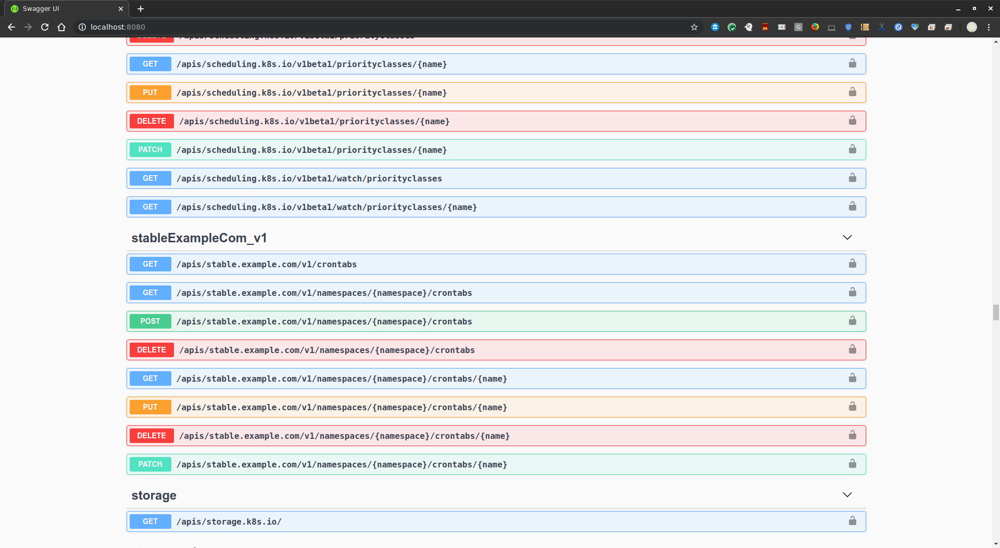

# Managing Kubernetes CustomResourceDefinitions with Google Deployment Manager

Defining and using [CustomResourceDefinitions](https://kubernetes.io/docs/concepts/extend-kubernetes/api-extension/custom-resources/#customresourcedefinitions) (CRD) in kubernetes is very common but up until now, creating and using CRDs entirely within [Google Cloud Deployment Manager](https://cloud.google.com/deployment-manager/docs/) (DM) wasn't possible.  This was because the the new API endpoints a CRD would define wasn't 'visible' to DM at all since kubernetes itself did not dynamically update its own OpenAPI specifications to reflect any new CRD.  If k8s API server never got updated, DM would never know about them.

As background, at its core DM simply applies and manages CRUD operations against an API. Almost always, the API server defines the a Google Cloud Service such as Compute Engine, Pub/Sub, Dataflow, etc  but you also define any arbitrary API endpoint as shown in here [Deployment Manager Type Provider Sample](https://github.com/salrashid123/gcp_dm_type_api)  Basically, when you define a DM `type-provider`, DM reads an OpenAPI or Swagger specification from remote a server and then during the requested operation, executes CRUD verb against that endpoint.  

When you create a GKE cluster using DM, DM applies CRUD operations against the GKE API to create the cluster.  Once the cluster is created, you can define a `type-provider` that now reads the actual kubernetes API server as another destination it can manage.  If DM is 'aware' of the kubernetes api server, it can apply  operations against that to create artifacts like `Deployments`, `Services` and generate `CustomResources`. 

CustomResources are special because the API endpoint to manage the CRD is now dynamically generated and only actually _visible_ as of k8s version `1.14` with
`CustomResourcePublishOpenAPI` defined within the [Alpha Feature Gate](https://kubernetes.io/docs/reference/command-line-tools-reference/feature-gates/#feature-gates-for-graduated-or-deprecated-features),

This tutorial will:

1. Deploy a GKE cluster
2. Define a [CustomResourceDefinitions](https://kubernetes.io/docs/concepts/extend-kubernetes/api-extension/custom-resources/#customresourcedefinitions) (CRD)
3. Create an instance of the CRD


>> Note, as of 11/8/19, this doc is a summary of the pending changes cited on [PR 348 of the DM-examples repo](https://github.com/GoogleCloudPlatform/deploymentmanager-samples/pull/384)

## Deploy a GKE cluster

Using Deployment Manager to first create the k8s api server with that flag enabled.


```bash
NAME="dm-1"
CLUSTER_NAME="dm-gke-cluster-1"
ZONE="us-central1-a"

gcloud deployment-manager deployments create ${NAME} \
    --template cluster.jinja \
    --properties clusterName:${CLUSTER_NAME},zone:${ZONE}

gcloud container clusters get-credentials $CLUSTER_NAME --zone $ZONE
```

#### View the k8s API server

Lets take a quick look at the API endpoints the default k8s API server comes with

First grab the k8s API endpoint which we can get in a number of ways.   Since we used deployment manager, it would be the API the `descriptorUrl` that it uses:

```bash
DESCRIPTOR_URL=`gcloud beta deployment-manager type-providers describe ${CLUSTER_NAME}-provider --format='value(descriptorUrl)'`
MASTER_IP=`gcloud container clusters describe $CLUSTER_NAME --zone $ZONE --format='value(endpoint)'`

mkdir -p files/
curl -sk -H "Authorization: Bearer `gcloud auth print-access-token`" $DESCRIPTOR_URL > files/swagger_default.json
```

Its rather difficult to view right now since it isn't formatted so if you want, you can either parse it with `jq` or use the swagger editor client

```
docker run -p 8080:8080 -e SWAGGER_JSON=/files/swagger_default.json -v `pwd`/files:/files swaggerapi/swagger-ui
```

Also note the list of existing CRDs kubernetes knows about

```
$ kubectl get crd
```

All that is nothing new...lets define the CRD


## Define CustomResourceDefinition

A CRD is basically an API endpoint that you define that gets registered with the kubernetes API server.

```bash
$ gcloud deployment-manager deployments create my-crd --template crd.jinja --properties clusterType:${CLUSTER_NAME}-provider
```

At this point, list the CRDs again via `kubectl` and you'll see the one we just deployed `crontabs.stable.example.com`

```bash
$ kubectl get crd
NAME                                    CREATED AT
crontabs.stable.example.com             2019-05-17T20:59:52Z
```

Inspect the updted Swagger specifcations as well and you'll notice a new endpoint was just setup:


```
curl -sk -H "Authorization: Bearer `gcloud auth print-access-token`" $DESCRIPTOR_URL > files/swagger_crd.json

$ cat files/swagger_crd.json  | jq '.' | grep /apis/stable.example.com/v1/namespaces/
    "/apis/stable.example.com/v1/namespaces/{namespace}/crontabs": {
    "/apis/stable.example.com/v1/namespaces/{namespace}/crontabs/{name}": {
```

(as before, you can view the swagger-ui definition of the same)

```
docker run -p 8080:8080 -e SWAGGER_JSON=/files/swagger_crd.json -v `pwd`/files:/files swaggerapi/swagger-ui
```




## Create an instance of the CRD

Now that k8s knows about the new endpoint, we can instruct it 'create' an instance of that new CRD.

Note the `CRD_COLLECTION` we are referencing for this collection...that tells DM the path to invoke and the variables to pass to it (eg, name,namespace, POST specifications, etc)

```yaml




resources:
- name: {{ NAME_PREFIX }}-crd
  type: {{ CLUSTER_TYPE }}:{{ CRD_COLLECTION }}
  properties:
    apiVersion: apiextensions.k8s.io/v1beta1
    kind: CustomResourceDefinition
    metadata:
      name: crontabs.stable.example.com
      namespace: default
    spec:
      group: stable.example.com
      versions:
        - name: v1
          served: true
          storage: true
      scope: Namespaced
      names:
        plural: crontabs
        singular: crontab
        kind: CronTab
        shortNames:
        - ct
```


So lets create that

```bash
$ gcloud deployment-manager deployments create my-crd-instance --template crd-instance.jinja --properties clusterType:${CLUSTER_NAME}-provider
```

Note the deployments we setup show the GKE cluster, the CRD and the instance as *separate* deployments (you can combine the CRD,CRD-instance into one command but aht ofcourse has cascading ramifications on delete)

```bash
$ gcloud deployment-manager deployments list
    dm-1                      insert               DONE                 manifest-1572649527023  []
    my-crd                    insert               DONE                 manifest-1572650044724  []
    my-crd-instance           insert               DONE                 manifest-1572656117578  []
```

Verify the CRD is created

```
$ kubectl get crd/crontabs.stable.example.com 
    NAME                          CREATED AT
    crontabs.stable.example.com   2019-11-08T16:08:38Z

$ kubectl get crontab -o yaml
    apiVersion: v1
    items:
    - apiVersion: stable.example.com/v1
    kind: CronTab
    metadata:
        creationTimestamp: "2019-11-08T16:21:49Z"
        generation: 1
        name: my-new-cron-object
        namespace: default
        resourceVersion: "132114"
        selfLink: /apis/stable.example.com/v1/namespaces/default/crontabs/my-new-cron-object
        uid: 21ee8d1d-f165-45bb-b4cb-30148963a6ce
    spec:
        cronSpec: '* * * * */5'
        image: my-awesome-cron-image
    kind: List
    metadata:
    resourceVersion: ""
    selfLink: ""
```

If you want to inspect the raw API at the CRD endpoint

```json
curl -sk -H "Authorization: Bearer `gcloud auth print-access-token`" https://$MASTER_IP/apis/stable.example.com/v1/namespaces/default/crontabs/my-new-cron-object | jq '.'
    {
    "apiVersion": "stable.example.com/v1",
    "kind": "CronTab",
    "metadata": {
        "creationTimestamp": "2019-11-08T16:21:49Z",
        "generation": 1,
        "name": "my-new-cron-object",
        "namespace": "default",
        "resourceVersion": "132114",
        "selfLink": "/apis/stable.example.com/v1/namespaces/default/crontabs/my-new-cron-object",
        "uid": "21ee8d1d-f165-45bb-b4cb-30148963a6ce"
    },
    "spec": {
        "cronSpec": "* * * * */5",
        "image": "my-awesome-cron-image"
    }
    }
```

## Delete the CRD Instance and CRD

Ok, we've now done all the steps...what about deleting and managing CRDs.  Thats easy...just rewind the steps we just set


```bash
$ gcloud deployment-manager deployments delete my-crd-instance -q

$ kubectl get crontab
    No resources found.

$ gcloud deployment-manager deployments delete my-crd -q
```

---

## DM and k8s state Drift

Note, if you delete the CRD or CRD definition directly via `kubectl`, deployment manager's state will not be consistent with what the GKE cluster has.  You will be left with DM's view of the k8  state that is out of sync:  DM will think that maybe the CRD instance exists when infact the CRD definition was removed (k8s will remove any child CRD instances since the parent was gone)

For example, if you delete the `crd` before you delete the instance, the CRD and CRD instance will both get deleted by the k8s server (it garbage collects orphaned objects)...however, DM does not know that `my-crd` is the "parent" of `my-crd-instance`.  That means, if you delete the crd and _then_ try to delete the instance, you will be left in an inconsistent state:

If i **FIRST** deleted the CRD Before the CRD instance

* `kubectl delete crd/crontabs.stable.example.com`
* `gcloud deployment-manager deployments create my-crd`

then when i run operations on the crd instance, k8s will report the CRD itself doens't exist

```
$ gcloud deployment-manager deployments delete my-crd-instance -q
                                           
ERROR: (gcloud.deployment-manager.deployments.delete) Delete operation operation-1573194880802-596cffa085df4-f5ead2da-f5163d29 failed.
Error in Operation [operation-1573194880802-596cffa085df4-f5ead2da-f5163d29]: errors:
- code: COLLECTION_NOT_FOUND
  message: Collection '/apis/stable.example.com/v1/namespaces/{namespace}/crontabs/{name}'
    not found in discovery doc 'https://104.197.146.73/openapi/v2'

$ gcloud deployment-manager deployments  list
NAME                      LAST_OPERATION_TYPE  STATUS  DESCRIPTION  MANIFEST                ERRORS
dm-1                      insert               DONE                 manifest-1573193309755  []
my-crd-instance           delete               DONE                 manifest-1573194205576  [COLLECTION_NOT_FOUND]
```

In which case you will have to terminate/abandon the orphaned resource directly:

```
$ gcloud deployment-manager deployments delete my-crd-instance -q --delete-policy=ABANDON
```

One way to mitigate ths is to define the CRD and Instances with [Explicit Dependencies](https://cloud.google.com/deployment-manager/docs/configuration/create-explicit-dependencies) but that ties you into a single management template or script.


## CRD/CRD Instance Operation latency

As of `11/8/19`, any operation that rereads the swagger specifications via DM takes an extraordinarily  long time.  This is a bug in DM where it rereads the specifications multiple times and parses it internally.  The fact that the k8s swagger specifications is quite large ~4MB, makes each operation to define or create take several minutes.   Knowing that level of latency maynot make this acceptable for management for large scale, rapid operations but this would get addressed later.


