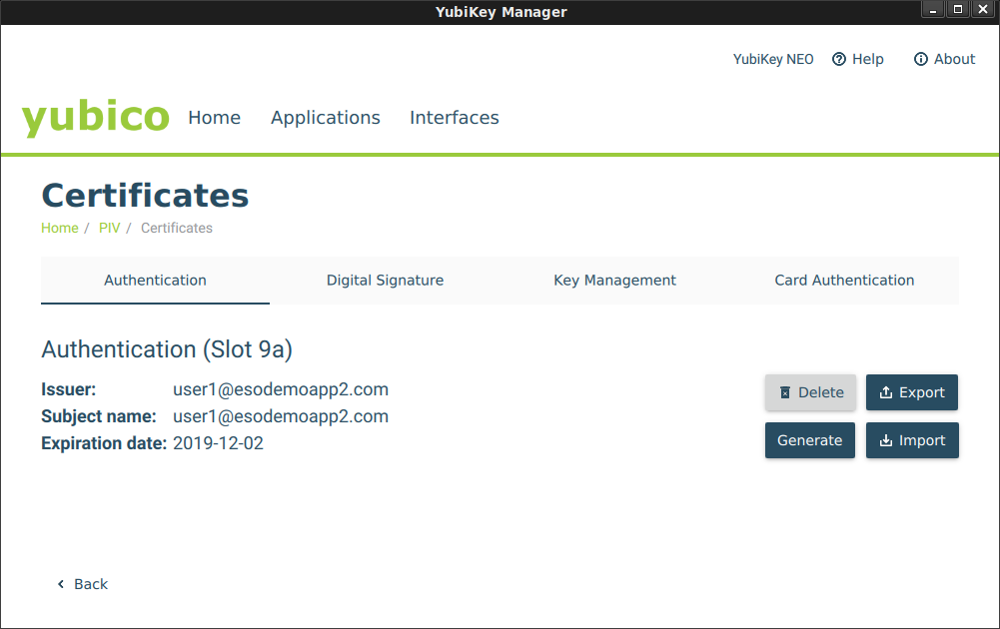

#  Google Cloud SSH with OS-Login with YubiKey OpenSC-PKCS11 and Trusted Platform Module (TPM) based keys

or _"How to embed SSH private keys into a Yubikey or TPM"_. 

First off, this is nothing new; its a rehash of decade old tech that i decided to try out since i happens to have a [YubiKey Neo](https://www.yubico.com/products/yubikey-hardware/yubikey%20neo/) and familiarity with [Trusted Platform Module](https://en.wikipedia.org/wiki/Trusted_Platform_Module) on a GCP [Shielded VM](https://cloud.google.com/security/shielded-cloud/shielded-vm).

Both the Yubikey Neo and TPM have one common capability here which this tutorial covers:  embedding an RSA private key inextricably into a hardware device and provide an interface to sign arbitrary data using that key.  By inextricably i mean once its on the device, it can be configured to never leave in its raw form and can only be made to do specific crypto operations (sign, decrypt, etc).

The application to public-key based SSH is straightforward: instead of SSH using the private keys normally saved under `~/.ssh/`, the keys are saved on the device itself.  For the yubikey, you need to insert the token while for the TPM you need to execute the command only on that specific VM that was configured.

For Google Compute Engine, [OS-Login](https://cloud.google.com/compute/docs/instances/managing-instance-access) allows administrators to define external RSA keys for access to specific VMs as declared through IAM policies.  This tutorial embeds RSA keys for use with GCP OS Login but ofcourse this procedure is applicable to any SSH system utilizing RSA keypairs.

>> This Repo is **NOT** supported by Google Cloud.  _caveat emptor_

## Refrences

- [Using PIV for SSH through PKCS11](https://developers.yubico.com/PIV/Guides/SSH_with_PIV_and_PKCS11.html)
- [TPM2-PKCS11 SSH Configuration](https://github.com/tpm2-software/tpm2-pkcs11/blob/master/docs/SSH.md)
- [OS-Login: adding Adding SSH keys to a user account](https://cloud.google.com/compute/docs/instances/managing-instance-access#add_oslogin_keys)
- [TPM2-TSS-Engine hello world and Google Cloud Authentication](https://github.com/salrashid123/tpm2_evp_sign_decrypt)
- [Google Cloud Yubikey TokenSource](https://github.com/salrashid123/yubikey)
- [Google Cloud TPM TokenSource](https://github.com/salrashid123/oauth2#usage-tpmtokensource)


## Yubikey

To embed certificates, you first neeed a [PIV-enabled Yubikey](https://developers.yubico.com/PIV/Introduction/YubiKey_and_PIV.html) such as a Yubikey Neo.  These advanced (and more expensive) Yubikeys allows you to (among other things) save keys into the device and execute crypto operations against it.

You can use either [YubiKey Neo or YubiKey 4 or 5](https://developers.yubico.com/PIV/Introduction/YubiKey_and_PIV.html) as those keys support embedded keys.

note, Google Titan keys do _not_ allow saving arbitrary data into it; its just U2F.


### Install Yubikey Admin Tools

On any, first install Yubikey tools to help embed the RSA key.  This step can be done on any system:  all we are doing here is provisioning the RSA key into the Yubikey

* [yubico-piv-tool CLI](https://developers.yubico.com/yubico-piv-tool/)
* [yubikey-manager-qt UI](https://developers.yubico.com/yubikey-manager-qt/development.html)


Plug in the Yubikey and verify you've got a YubiKey Neo:

Check Yubikey is plugged in
	
```bash
$ lsusb  | grep -i yubikey
Bus 001 Device 013: ID 1050:0111 Yubico.com Yubikey NEO(-N) OTP+CCID
```

### Install OpenSC

Install PKCS11 [OpenSC](https://github.com/OpenSC/OpenSC) support

```bash
sudo apt-get install opensc opensc-pkcs11
```

Confirm the OpenSC PKCS Library is installed.  eg:

```
/usr/lib/x86_64-linux-gnu/opensc-pkcs11.so
```

You will need to install OpenSC on any system you wish to use the Yubikey.  You do not ofcourse need ot install the yubico toolsets anywhere else other than the system where you embed the key.

### Generate or Import RSA Key

You can either generate an RSA keypair directly on the Yubikey or import one externally.  In the following, we will generate a keypair externally and then import.

- Set the OS Login Username as env-var

```
echo OS_LOGIN_USER=user_esodemoapp2_com
```

- Geneate te private,public RSA keypair _and_ an X509 certificate (the latter is used by Yubkey and isn't required for SSh)

```
openssl genrsa -out private.pem 2048
openssl rsa -in private.pem -outform PEM -pubout -out public.pem

openssl req -new -x509  -key private.pem  -out public.crt -subj "/CN=$OS_LOGIN_USER/"
openssl x509 -in public.crt -text -noout
```

- Import the Private key and X509 cert:

```
yubico-piv-tool -s 9a -a import-key -i private.pem
yubico-piv-tool -a import-certificate -s 9a -i public.crt
```

if you launch `yubikey-manager-qt`, you should see your certificate now in slot `9a` 




>> Note, at this moment, you can **DELETE* the keys you just created (private.pem)...it now exists on the Yubikey

### Export RSA key from the Yubikey

```bash
echo `ssh-keygen -D /usr/lib/x86_64-linux-gnu/opensc-pkcs11.so`   | tee my.pub
```

Now edit `my.pub` to remove any extra certificates that mybe there.  That is `opensc-pkcs11.so` outputs all public keys from the yubkey in numeric order; we just need slot `9a` which is the first one so edit my.pub and keep the first `ssh-rsa` entry.  If you didn't embed any other certificates prior to this, then you should only see one key.


### Upload RSA key to GCP

```
$ gcloud compute os-login ssh-keys add --key-file my.pub

loginProfile:
  name: '108157913093274845548'
  posixAccounts:
  - accountId: your_project
    gid: '1074457818'
    homeDirectory: /home/user1_esodemoapp2_com
    name: users/user1@esodemoapp2.com/projects/yourproject
    operatingSystemType: LINUX
    primary: true
    uid: '1074457818'
    username: user1_esodemoapp2_com
  sshPublicKeys:
    722a2d7dec12c037cecda888013656a420937662be643a4e375b7d5bfe62997f:
      fingerprint: 722a2d7dec12c037cecda888013656a420937662be643a4e375b7d5bfe62997f
      key: |
        ssh-rsa AAAAB3NzaC1yc2EAredacted
      name: users/user1@esodemoapp2.com/sshPublicKeys/722a2d7dec12c037cecda888013656a420937662be643a4e375b7d5bfe62997f
```


### Create OS-Login Enabled VM and set IAM permission 

Create a GCP OS-Login enabled VM and then set IAM Permission to allow access:

- [Setting up OS Login](https://cloud.google.com/compute/docs/instances/managing-instance-access#granting_os_login_iam_roles)


### SSH and use opensc-pkcs11.so as source of the keys

Get the public IP of the VM you have enabled OS login and IAM permissions, then SSH in while specifying the opensc-pkcs11 library:

```
ssh -I /usr/lib/x86_64-linux-gnu/opensc-pkcs11.so user1_esodemoapp2_com@35.225.191.58
```

If you enable `-vvv` in the SSH command, you should see indication that keys are read from `opensc-pkcs11.so`.

If you are prompted for a PIN, enter the one you setup on the Yubikey [default](https://developers.yubico.com/yubico-piv-tool/YubiKey_PIV_introduction.html).  The default code is `123456`

```
debug1: provider /usr/lib/x86_64-linux-gnu/opensc-pkcs11.so: manufacturerID <OpenSC Project> cryptokiVersion 2.20 libraryDescription <OpenSC smartcard framework> libraryVersion 0.19
debug1: provider /usr/lib/x86_64-linux-gnu/opensc-pkcs11.so slot 0: label <srashid_google_com> manufacturerID <piv_II> model <PKCS#15 emulate> serial <295a1be28d916b2> flags 0x40d

debug1: Offering public key: /usr/lib/x86_64-linux-gnu/opensc-pkcs11.so RSA SHA256:f8SYSZMBH3FjwgredgZx6YVuxHJGS+nN0GcYscA82lc token
debug3: send packet: type 50
debug2: we sent a publickey packet, wait for reply
debug3: receive packet: type 60
debug1: Server accepts key: /usr/lib/x86_64-linux-gnu/opensc-pkcs11.so RSA SHA256:f8SYSZMBH3FjwgredgZx6YVuxHJGS+nN0GcYscA82lc token
debug3: sign_and_send_pubkey: RSA SHA256:f8SYSZMBH3FjwgredgZx6YVuxHJGS+nN0GcYscA82lc
debug3: sign_and_send_pubkey: signing using ssh-rsa
Enter PIN for 'user1_esodemoapp2_com': 
```

If everything went allright, you should be logged into the VM!

---


## TPM2

Embedding RSA keyapair into a TPM ofcourse requires a machine with a TPM!:

Fortunately, Google Cloud Shielded VMs hav one enabled so you can use this to test:

### Create ShieldedVM
```
gcloud  compute  instances create shielded-6 --zone=us-central1-a --machine-type=n1-standard-1 --no-service-account --no-scopes --image=ubuntu-1804-bionic-v20191002 --image-project=gce-uefi-images --no-shielded-secure-boot --shielded-vtpm --shielded-integrity-monitoring
```

### Install TPM2-PKCS11 package

SSH to the VM and install [tpm2-pkcs11](https://github.com/tpm2-software/tpm2-pkcs11) package.  This library uses `tpm2_tools`, `tpm2-tss` internally to provide the PKCS11 interface to the TPM and from there SSH support

- [https://github.com/tpm2-software/tpm2-pkcs11/blob/master/docs/SSH.md](https://github.com/tpm2-software/tpm2-pkcs11/blob/master/docs/SSH.md)


>> Note the disclaimer on the `tpm2-pkcs11` package;  at the time of writing 11/3/19, it is **NOT** recommended for production use.


```bash
apt-get update

apt -y install   autoconf-archive   libcmocka0   libcmocka-dev   procps   iproute2   build-essential   git   pkg-config   gcc   libtool   automake   libssl-dev   uthash-dev   autoconf   doxygen  libcurl4-openssl-dev dbus-x11 libglib2.0-dev   libcurl4-openssl-dev  libsqlite3-dev  python  python-yaml python-pip
```

Then install the components
```
cd
git clone https://github.com/tpm2-software/tpm2-tss.git
  cd tpm2-tss
  ./bootstrap
  ./configure --with-udevrulesdir=/etc/udev/rules.d
  make -j$(nproc)
  make install
  udevadm control --reload-rules && sudo udevadm trigger
  ldconfig

cd
git clone https://github.com/tpm2-software/tpm2-tools.git
  cd tpm2-tools
  ./bootstrap
  ./configure
  make check
  make install

cd
git clone https://github.com/tpm2-software/tpm2-pkcs11
cd tpm2-pkcs11
./bootstrap
./configure
make
make install
```

Once installed, you should see `libtpm2_pkcs11.so` library available for use.  On debian, its at:

```
/usr/local/lib/libtpm2_pkcs11.so
```

### Import External RSA key into TPM

Now use the `tpm2_ptool` wrapper client for `tpm2_tools` to generate a primary object and import the RSA key.

In the following, we will use the _same_ RSA key for the Yubikey sample defined in `Generate or Import RSA Key` above (i.,e you should have `private.pem` file handy and in the folder below where it is specified)


```bash
echo OS_LOGIN_USER=user1_esodemoapp2_com
cd /root/tpm2-pkcs11/tools

./tpm2_ptool init
  Created a primary object of id: 1

./tpm2_ptool addtoken --pid=1  --sopin=mysopin --userpin=123456 --label $OS_LOGIN_USER
  Created token label: user1_esodemoapp2_com

./tpm2_ptool import --userpin 123456 --privkey /path/to/private.pem --label $OS_LOGIN_USER --algorithm rsa
   Imported key as label: "1"
```

>> Note: internally, i belive the above does something like the following:
  ```
      tpm2_createprimary -C o -g sha256 -G rsa -c primary.ctx
      tpm2_import -C primary.ctx -G rsa -i private.pem -u key.pub -r key.prv
      tpm2_load -C primary.ctx -u key.pub -r key.prv -c key.ctx
  ```

### Export the Public SSH key from the TPM itself

The follwing will extract the public SSH-formatted public key from the TPM.  Note, if we used the same private key as in the Yubikey setup, the public portion will ofcourse be the same
```
ssh-keygen -D /usr/local/lib/libtpm2_pkcs11.so | tee my.pub
```

`my.pub` should look something like
```
ssh-rsa AAAAB3redacted...
```

### Enable OS-Login for the generated key

```
$ gcloud compute os-login ssh-keys add --key-file my.pub
```


### SSH in and specify the source token

Use the public IP of the OS Login VM you geneated in the Yubikey Setup stage.  The PIN is `123456` as specified in the setup

```bash
ssh -I /usr/local/lib/libtpm2_pkcs11.so $OS_LOGIN_USER@35.225.191.58
  Enter PIN for 'user1_esodemoapp2_com': 
```

## Final notes

- To restate, this is nothing new...the Yubikey stuff is just PIV-smartcard stuff thats been around for a long time.
- TPM based PKCS is still in development; DO NOT use this is production.  
- TPM setup for PKCS11 uses some sort of sqlite3 datastore which i need to understand more.  I'd rather just manually provision the TPM and have a persistent handle plus  custom authorization policies (PCR values, etc) as available restricts.  They maybe somewher in the tool but i didn't see it readily.
- This is just for amusement only.