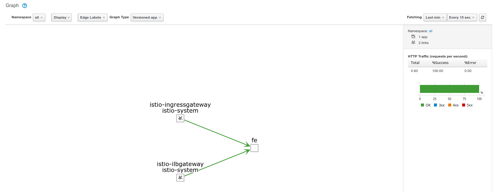

# Istio gRPC Loadbalancing with GCP Internal LoadBalancer (ILB)


Demonstrates gRPC loadbalancing with Istio where mesh-external clients connect via GCP external and internal LoadBalancers:


- `client_grpc_app (on GCEVM) --> (GCP ILB) --> Istio --> Service`

- `client_grpc_app (external) --> (GCP ExternalLB) --> Istio --> Service`


- https://cloud.google.com/istio/docs/istio-on-gke/installing#supported_gke_cluster_versions
  - uses ISTIO version `1.0.6` -> GKE version `	1.11.7`


1) Install GKE+Istio


>> Make sure the current gcloud user `gcloud config get-value core/account`  has the `Kubernetes Engine Admin` IAM role set on the current project
`gcloud config get-value core/project`

```bash

export CLUSTER_VERSION=1.11.7
export ZONE=us-central1-a

gcloud beta container clusters create istio-demo \
    --addons=Istio --istio-config=auth=MTLS_STRICT \
    --cluster-version=$CLUSTER_VERSION \
    --zone=$ZONE \
    --machine-type=n1-standard-2 \
    --enable-ip-alias \
    --num-nodes=4

gcloud container clusters get-credentials istio-demo --zone $ZONE

kubectl create clusterrolebinding cluster-admin-binding --clusterrole=cluster-admin --user=$(gcloud config get-value core/account)


export ISTIO_VERSION=1.0.6
wget https://github.com/istio/istio/releases/download/$ISTIO_VERSION/istio-$ISTIO_VERSION-linux.tar.gz
tar xvzf istio-$ISTIO_VERSION-linux.tar.gz

wget https://storage.googleapis.com/kubernetes-helm/helm-v2.11.0-linux-amd64.tar.gz
tar xf helm-v2.11.0-linux-amd64.tar.gz

export PATH=`pwd`/istio-$ISTIO_VERSION/bin:`pwd`/linux-amd64/:$PATH

 kubectl label namespace default istio-injection=enabled
```

2. Enable ILB for Istio

Then install/enable ILB:

```bash

helm template --set gateways.istio-ilbgateway.enabled=false --namespace istio-system istio-$ISTIO_VERSION/install/kubernetes/helm/istio > off.yaml
helm template --set gateways.istio-ilbgateway.enabled=true --namespace istio-system istio-$ISTIO_VERSION/install/kubernetes/helm/istio > on.yaml
diff --line-format=%L on.yaml off.yaml > ilb.yaml

kubectl apply -f ilb.yaml
```

3. Verify external and ILB IP addresses

Wait ~5mins

```bash
kubectl get svc istio-ingressgateway -n istio-system
export GATEWAY_IP=$(kubectl -n istio-system get service istio-ingressgateway -o jsonpath='{.status.loadBalancer.ingress[0].ip}')
echo $GATEWAY_IP

kubectl get svc istio-ilbgateway  -n istio-system
export ILB_GATEWAY_IP=$(kubectl -n istio-system get service istio-ilbgateway -o jsonpath='{.status.loadBalancer.ingress[0].ip}')
echo $ILB_GATEWAY_IP

```

4. Deploy sample application

Source code for the sample application is in the `app/` folder for this repo.

The grpc application creates one gRPC Channel to the server and on that one connection, sends 10 RPC requests.

```
kubectl apply -f secrets.yaml -f app.yaml 

kubectl apply -f istio-vs-dstrule.yaml \
   -f istio-ilbgateway-service.yaml -f istio-ingress-gateway.yaml \
   -f istio-ingress-ilbgateway.yaml
```

- List deployment and pod names

```
$ kubectl get po,deployment,secret 
NAME                                 READY     STATUS    RESTARTS   AGE
pod/fe-deployment-6c65dbd777-8fx97   2/2       Running   0          4m
pod/fe-deployment-6c65dbd777-8v4sp   2/2       Running   0          4m
pod/fe-deployment-6c65dbd777-ddsvh   2/2       Running   0          4m
pod/fe-deployment-6c65dbd777-zh8zr   2/2       Running   0          4m

NAME                                  DESIRED   CURRENT   UP-TO-DATE   AVAILABLE   AGE
deployment.extensions/fe-deployment   4         4         4            4           4m

NAME                         TYPE                                  DATA      AGE
secret/app-certs             Opaque                                2         4m
secret/default-token-4d9zn   kubernetes.io/service-account-token   3         16m
secret/istio.default         istio.io/key-and-cert                 3         14m

```


### Verify External client connectivity


```bash
docker  run --add-host grpc.domain.com:$GATEWAY_IP -t salrashid123/istioilb /grpc_client --host grpc.domain.com:443
```

You should see responses from different service addresses:

```bash
docker  run --add-host grpc.domain.com:$GATEWAY_IP -v `pwd`/certs:/data/certs -t salrashid123/istioilb /grpc_client --host grpc.domain.com:443
2019/03/24 16:47:08 RPC Response: 0 message:"Hello unary RPC msg   from hostname fe-deployment-6c65dbd777-ddsvh" 
2019/03/24 16:47:09 RPC Response: 1 message:"Hello unary RPC msg   from hostname fe-deployment-6c65dbd777-8v4sp" 
2019/03/24 16:47:10 RPC Response: 2 message:"Hello unary RPC msg   from hostname fe-deployment-6c65dbd777-zh8zr" 
2019/03/24 16:47:11 RPC Response: 3 message:"Hello unary RPC msg   from hostname fe-deployment-6c65dbd777-8fx97" 

```

### Verify Internal client connectivity

First create a GCP VM within the same VPC that has docker installed.  SSH in and run:
  
```bash
  mkdir certs
  wget -O certs/tls.crt https://raw.githubusercontent.com/salrashid123/gcegrpc/master/certs/server_crt.pem

  docker  run --add-host grpc.domain.com:$ILB_GATEWAY_IP -v `pwd`/certs:/data/certs \
     -t salrashid123/istioilb /grpc_client --host grpc.domain.com:443 
```

You should see responses from different service addresses:

```bash
docker  run --add-host grpc.domain.com:$ILB_GATEWAY_IP -v `pwd`/certs:/data/certs \
   -t salrashid123/istioilb /grpc_client --host grpc.domain.com:443 

2019/03/24 16:52:33 RPC Response: 0 message:"Hello unary RPC msg   from hostname fe-deployment-6c65dbd777-ddsvh" 
2019/03/24 16:52:34 RPC Response: 1 message:"Hello unary RPC msg   from hostname fe-deployment-6c65dbd777-8v4sp" 
2019/03/24 16:52:35 RPC Response: 2 message:"Hello unary RPC msg   from hostname fe-deployment-6c65dbd777-zh8zr" 
2019/03/24 16:52:36 RPC Response: 3 message:"Hello unary RPC msg   from hostname fe-deployment-6c65dbd777-8fx97"
```

If you deployed and setup `Kiali`, you should see traffic inbound from the ILB and external gateway:




---


# gRPC client/server test app


## Build
```
docker build -t salrashid123/istioilb .
```

## Run Server

```
docker run -p 50051:50051 -p 8081:8081 -v `pwd`/certs:/data/certs  salrashid123/istioilb /grpc_server -grpcport 0.0.0.0:50051 -httpport :8081
```

## Run Client

```
docker run --net=host --add-host grpc.domain.com:127.0.0.1 -t -v `pwd`/certs:/data/certs  salrashid123/istioilb  /grpc_client --host grpc.domain.com:50051
```

