Scratchpad for ingress-gce changes 

- ref: [https://github.com/kubernetes/ingress-gce/issues/18](https://github.com/kubernetes/ingress-gce/issues/18)


Testcases covered IG based deployment as well as NEG for both HTTP(S) services as well as gRPC

- Instance Group
  - Default HC (HTTP backend)
  - Custom Path HC (HTTP backend)
  - Custom Path HC (gRPC Backend)
  - Custom Path + Protocol Change (gRPC)
  - Custom Path HC with namedPort (HTTP backend)
  - Custom Path HC with namedPort (gRPC backend)

- NEG
  - Custom Path (HTTP)
  - Default HC (gRPC)

> Note grpc+NEG doesn't work as is because the healthcheck NEG invokes is over HTTP/2 (not grpc)

Potential solution is to use mux...

- https://github.com/salrashid123/gcegrpc/tree/master/gke_ingress_lb


### IG

#### Default HC (HTTP)

```yaml
apiVersion: apps/v1
kind: Deployment
metadata:
  name: myapp-deployment
  labels:
    type: myapp-deployment-label
spec:
  replicas: 2
  selector:
    matchLabels:
      type: myapp
  template:
    metadata:
      labels:
        type: myapp
        tier: frontend
        version: v1
    spec:
      containers:
      - name: frontend
        image: salrashid123/istioinit:1
        imagePullPolicy: IfNotPresent
        ports:
        - containerPort: 8080
          protocol: TCP
      - name: sidecar
        image: nginx
        imagePullPolicy: IfNotPresent
        ports:
        - containerPort: 80
          protocol: TCP
---
apiVersion: extensions/v1beta1
kind: Ingress
metadata:
  name: myapp-srv-ingress
  annotations:
    kubernetes.io/ingress.allow-http: "false"
spec:
  tls:
  - secretName: gkecert-tmp
  rules:
  - http:
      paths:
      - path: /*
        backend:
          serviceName: myapp-srv
          servicePort: 8080
---
apiVersion: v1
kind: Service
metadata:
  name: myapp-srv
  labels:
    type: myapp-srv
spec:
  type: NodePort
  ports:
  - name: fe
    port: 8080
    protocol: TCP
    targetPort: 8080
  selector:
    type: myapp
```

```
$ kubectl get deployment,ing,svc
NAME                               READY   UP-TO-DATE   AVAILABLE   AGE
deployment.apps/myapp-deployment   2/2     2            2           12m

NAME                                   HOSTS   ADDRESS          PORTS     AGE
ingress.extensions/myapp-srv-ingress   *       35.227.244.196   80, 443   12m

NAME                 TYPE        CLUSTER-IP   EXTERNAL-IP   PORT(S)          AGE
service/kubernetes   ClusterIP   10.0.0.1     <none>        443/TCP          8h
service/myapp-srv    NodePort    10.0.34.1    <none>        8080:31702/TCP   12m
```


- 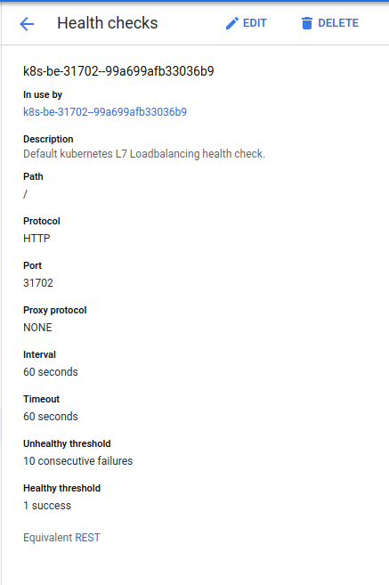

- 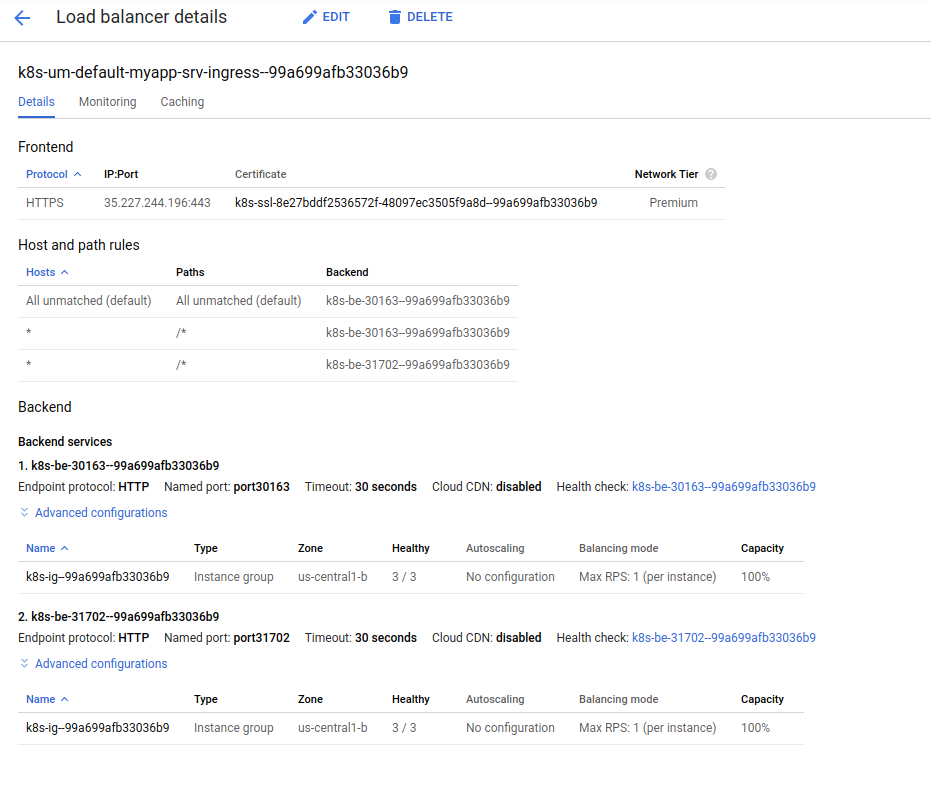


#### Custom Path (HTTP)

```yaml
apiVersion: apps/v1
kind: Deployment
metadata:
  name: myapp-deployment
  labels:
    type: myapp-deployment-label
spec:
  replicas: 2
  selector:
    matchLabels:
      type: myapp
  template:
    metadata:
      labels:
        type: myapp
        tier: frontend
        version: v1
    spec:
      containers:
      - name: frontend
        image: salrashid123/istioinit:1
        imagePullPolicy: IfNotPresent
        ports:
        - containerPort: 8080
          protocol: TCP
        livenessProbe:
          httpGet:
            path: /_ah/health
            port: 8080
        readinessProbe:
          httpGet:
            path: /_ah/health
            port: 8080
      - name: sidecar
        image: nginx
        imagePullPolicy: IfNotPresent
        ports:
        - containerPort: 80
          protocol: TCP
---
apiVersion: extensions/v1beta1
kind: Ingress
metadata:
  name: myapp-srv-ingress
  annotations:
    kubernetes.io/ingress.allow-http: "false"
spec:
  tls:
  - secretName: gkecert-tmp
  rules:
  - http:
      paths:
      - path: /*
        backend:
          serviceName: myapp-srv
          servicePort: 8080
---
apiVersion: v1
kind: Service
metadata:
  name: myapp-srv
  labels:
    type: myapp-srv
spec:
  type: NodePort
  ports:
  - name: fe
    port: 8080
    protocol: TCP
    targetPort: 8080
  selector:
    type: myapp
```


```bash
$ kubectl get deployment,po,ing,svc
NAME                               READY   UP-TO-DATE   AVAILABLE   AGE
deployment.apps/myapp-deployment   2/2     2            2           11m

NAME                                    READY   STATUS    RESTARTS   AGE
pod/myapp-deployment-5d8496b979-mswqh   2/2     Running   0          11m
pod/myapp-deployment-5d8496b979-rk8dz   2/2     Running   0          11m

NAME                                   HOSTS   ADDRESS        PORTS     AGE
ingress.extensions/myapp-srv-ingress   *       35.190.53.93   80, 443   11m

NAME                 TYPE        CLUSTER-IP     EXTERNAL-IP   PORT(S)          AGE
service/kubernetes   ClusterIP   10.0.0.1       <none>        443/TCP          9h
service/myapp-srv    NodePort    10.0.158.215   <none>        8080:30374/TCP   11m
```


```yaml
```

```bash
```


- 

- 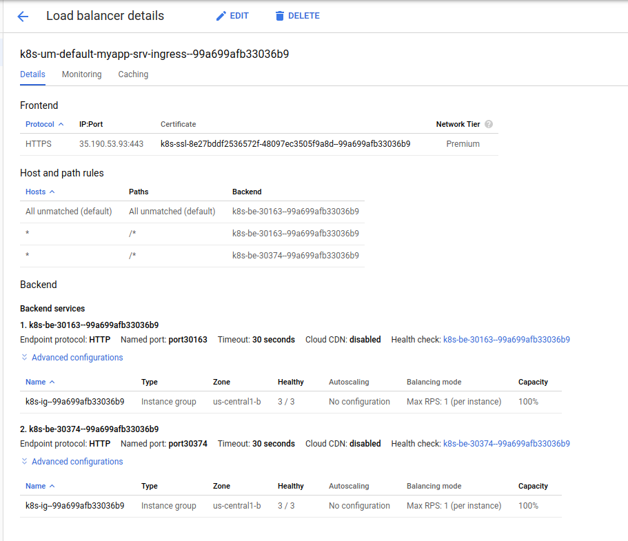


#### Custom Path (gRPC)

```yaml
apiVersion: apps/v1
kind: Deployment
metadata:
  name: fe-deployment
  labels:
    app: fe
spec:
  replicas: 2
  selector:
    matchLabels:
      app: fe
  template:
    metadata:
      labels:
        app: fe
    spec:
      containers:
      - name: fe-hc
        image: salrashid123/grpc_health_proxy
        imagePullPolicy: IfNotPresent
        ports:
        - containerPort: 8080
          protocol: TCP
        livenessProbe:
          httpGet:
            path: "/_ah/health"
            port: 8080
            scheme: HTTP
        readinessProbe:
          httpGet:
            path: "/_ah/health"
            scheme: HTTP
            port: 8080
        # for scheme: HTTP
        args: ["--http-listen-addr", ":8080", "--http-listen-path", "/_ah/health", "--grpcaddr", "localhost:50051", "--grpctls", "--grpc-ca-cert=/data/certs/CA_crt.pem", "--grpc-sni-server-name=grpc.domain.com", "--service-name", "echo.EchoServer", "--logtostderr=1", "-v=10"]
        volumeMounts:
        - name: certs-volume
          mountPath: /data/certs
      - name: fe-grpc
        image: salrashid123/grpc_only_backend
        imagePullPolicy: IfNotPresent
        ports:
        - containerPort: 50051
          protocol: TCP
        command: ["/grpc_server"]
        args: ["--grpcport", ":50051"]
      volumes:
        - name: certs-volume
          secret:
            secretName: fe-ca-cert
---
apiVersion: v1
kind: Service
metadata:
  name: fe-srv-ingress
  labels:
    type: fe-srv
  annotations:
    cloud.google.com/app-protocols: '{"fe-web": "HTTP", "fe-grpc":"HTTP2"}'
    #cloud.google.com/neg: '{"ingress": true }'
spec:
  type: NodePort
  ports:
  - name: fe-web
    port: 8080
    protocol: TCP
    targetPort: 8080
  - name: fe-grpc
    port: 443
    protocol: TCP
    targetPort: 50051
  selector:
    app: fe
---
apiVersion: extensions/v1beta1
kind: Ingress
metadata:
  name: fe-ingress
  annotations:
    kubernetes.io/ingress.class: "gce"
    kubernetes.io/ingress.allow-http: "false"
spec:
  tls:
  - hosts:
    - server.domain.com
    secretName: fe-secret
  backend:
    serviceName: fe-srv-ingress
    servicePort: 443
```

```bash
$ kubectl get deployment,po,ing,svc
NAME                            READY   UP-TO-DATE   AVAILABLE   AGE
deployment.apps/fe-deployment   2/2     2            2           49s

NAME                                 READY   STATUS    RESTARTS   AGE
pod/fe-deployment-579f74c44c-khshc   2/2     Running   0          49s
pod/fe-deployment-579f74c44c-wdcvr   2/2     Running   0          49s

NAME                            HOSTS   ADDRESS        PORTS     AGE
ingress.extensions/fe-ingress   *       35.190.53.93   80, 443   49s

NAME                     TYPE        CLUSTER-IP     EXTERNAL-IP   PORT(S)                        AGE
service/fe-srv-ingress   NodePort    10.0.194.188   <none>        8080:30713/TCP,443:30927/TCP   49s
service/kubernetes       ClusterIP   10.0.0.1       <none>        443/TCP                        9h
```


- 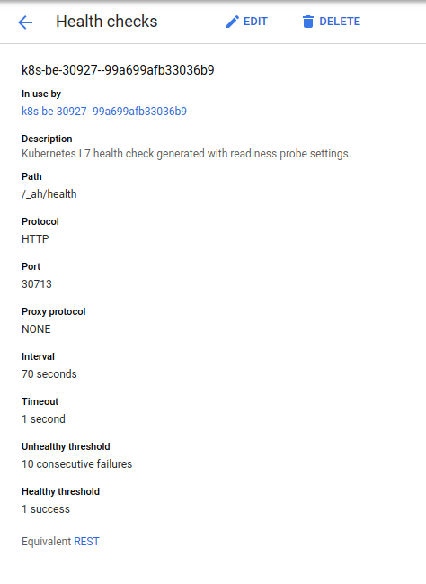

- 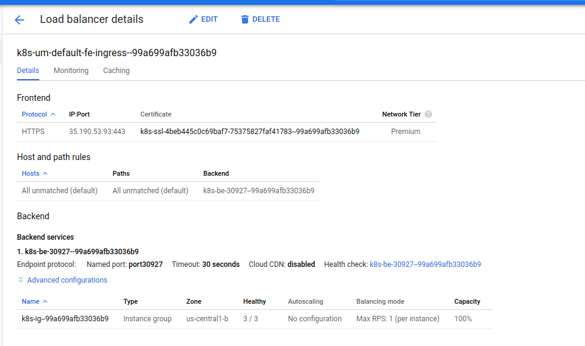

---


#### Custom Path Protocol Change (gRPC)

```yaml
---
apiVersion: v1
kind: Service
metadata:
  name: fe-srv-ingress
  labels:
    type: fe-srv
  annotations:
    cloud.google.com/app-protocols: '{"fe-web": "HTTPS", "fe-grpc":"HTTP2"}'
spec:
  type: NodePort
  ports:
  - name: fe-web
    port: 8080
    protocol: TCP
    targetPort: 8080
  - name: fe-grpc
    port: 443
    protocol: TCP
    targetPort: 50051
  selector:
    app: fe
---
apiVersion: apps/v1
kind: Deployment
metadata:
  name: fe-deployment
  labels:
    app: fe
spec:
  replicas: 2
  selector:
    matchLabels:
      app: fe
  template:
    metadata:
      labels:
        app: fe
    spec:
      containers:
      - name: fe-hc
        image: salrashid123/grpc_health_proxy
        imagePullPolicy: IfNotPresent
        ports:
        - containerPort: 8080
          protocol: TCP
        livenessProbe:
          httpGet:
            path: "/_ah/health"
            port: 8080
            scheme: HTTPS
        readinessProbe:
          httpGet:
            path: "/_ah/health"
            scheme: HTTPS
            port: 8080
        # for scheme: HTTPS            
        args: ["--http-listen-addr", ":8080", "--http-listen-path", "/_ah/health", "--https-listen-cert=/data/certs/http_server_crt.pem","--https-listen-key=/data/certs/http_server_key.pem", "--grpcaddr", "localhost:50051", "--grpctls", "--grpc-ca-cert=/data/certs/CA_crt.pem", "--grpc-sni-server-name=grpc.domain.com", "--service-name", "echo.EchoServer", "--logtostderr=1", "-v=10"]
        volumeMounts:
        - name: certs-volume
          mountPath: /data/certs
      - name: fe-grpc
        image: salrashid123/grpc_only_backend
        imagePullPolicy: IfNotPresent
        ports:
        - containerPort: 50051
          protocol: TCP
        command: ["/grpc_server"]
        args: ["--grpcport", ":50051"]
      volumes:
        - name: certs-volume
          secret:
            secretName: fe-ca-cert
---
apiVersion: extensions/v1beta1
kind: Ingress
metadata:
  name: fe-ingress
  annotations:
    kubernetes.io/ingress.class: "gce"
    kubernetes.io/ingress.allow-http: "false"
spec:
  tls:
  - hosts:
    - server.domain.com
    secretName: fe-secret
  backend:
    serviceName: fe-srv-ingress
    servicePort: 443
```


```bash
$ kubectl get ing,deployments,po,svc
NAME                            HOSTS   ADDRESS        PORTS     AGE
ingress.extensions/fe-ingress   *       35.190.53.93   80, 443   80s

NAME                            READY   UP-TO-DATE   AVAILABLE   AGE
deployment.apps/fe-deployment   2/2     2            2           80s

NAME                                 READY   STATUS    RESTARTS   AGE
pod/fe-deployment-5847d75996-8944q   2/2     Running   0          80s
pod/fe-deployment-5847d75996-jm7sf   2/2     Running   0          80s

NAME                     TYPE        CLUSTER-IP     EXTERNAL-IP   PORT(S)                        AGE
service/fe-srv-ingress   NodePort    10.0.126.194   <none>        8080:31598/TCP,443:32016/TCP   79s
service/kubernetes       ClusterIP   10.0.0.1       <none>        443/TCP                        27h
```

- 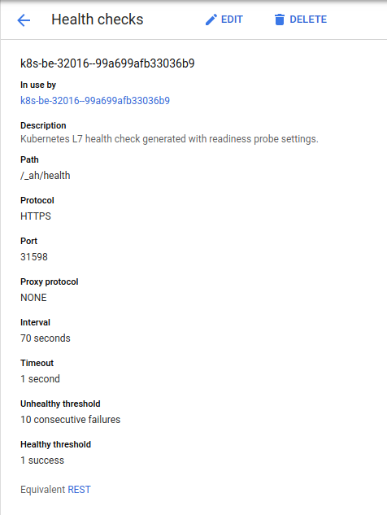

- 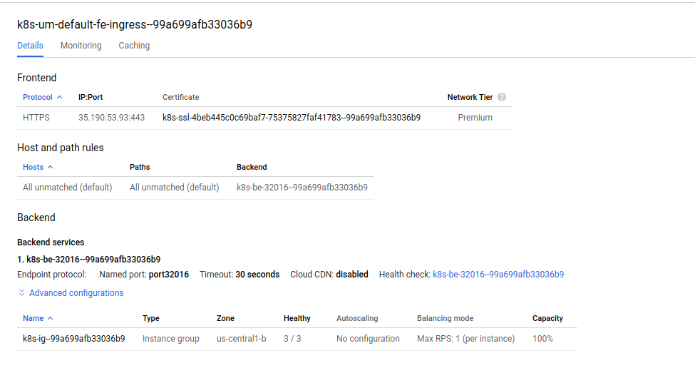


  - Custom Path HC with namedPort (HTTP backend)

- 
```yaml
apiVersion: apps/v1
kind: Deployment
metadata:
  name: myapp-deployment
  labels:
    type: myapp-deployment-label
spec:
  replicas: 2
  selector:
    matchLabels:
      type: myapp
  template:
    metadata:
      labels:
        type: myapp
        tier: frontend
        version: v1
    spec:
      containers:
      - name: frontend
        image: salrashid123/istioinit:1
        imagePullPolicy: IfNotPresent
        ports:
        - containerPort: 8080
          protocol: TCP
          name: srv-port
        livenessProbe:
          httpGet:
            path: /_ah/health
            port: srv-port
        readinessProbe:
          httpGet:
            path: /_ah/health
            port: srv-port
---
apiVersion: v1
kind: Service
metadata:
  name: myapp-srv
  #annotations:
  #  cloud.google.com/neg: '{"ingress": true, "exposed_ports":{"8080":{}}}'
  labels:
    type: myapp-srv
spec:
  type: NodePort
  ports:
  - name: fe
    port: 8080
    protocol: TCP
    targetPort: srv-port
  selector:
    type: myapp

```

  - Custom Path HC with namedPort (gRPC backend)

```yaml
apiVersion: apps/v1
kind: Deployment
metadata:
  name: fe-deployment
  labels:
    app: fe
spec:
  replicas: 2
  selector:
    matchLabels:
      app: fe
  template:
    metadata:
      labels:
        app: fe
    spec:
      containers:
      - name: fe-hc
        image: salrashid123/grpc_health_proxy
        imagePullPolicy: IfNotPresent
        ports:
        - containerPort: 8080
          protocol: TCP
          name: hc-port
        livenessProbe:
          httpGet:
            path: "/_ah/health"
            port: hc-port
            scheme: HTTP
        readinessProbe:
          httpGet:
            path: "/_ah/health"
            scheme: HTTP
            port: hc-port
        # for scheme: HTTPS
        #args: ["--http-listen-addr", ":8080", "--http-listen-path", "/_ah/health", "--https-listen-cert=/data/certs/http_server_crt.pem","--https-listen-key=/data/certs/http_server_key.pem", "--grpcaddr", "localhost:50051", "--grpctls", "--grpc-ca-cert=/data/certs/CA_crt.pem", "--grpc-sni-server-name=grpc.domain.com", "--service-name", "echo.EchoServer", "--logtostderr=1", "-v=10"]
        # for scheme: HTTP
        args: ["--http-listen-addr", ":8080", "--http-listen-path", "/_ah/health", "--grpcaddr", "localhost:50051", "--grpctls", "--grpc-ca-cert=/data/certs/CA_crt.pem", "--grpc-sni-server-name=grpc.domain.com", "--service-name", "echo.EchoServer", "--logtostderr=1", "-v=10"]
        volumeMounts:
        - name: certs-volume
          mountPath: /data/certs
      - name: fe-grpc
        image: salrashid123/grpc_only_backend
        imagePullPolicy: IfNotPresent
        ports:
        - containerPort: 50051
          protocol: TCP
        command: ["/grpc_server"]
        args: ["--grpcport", ":50051"]
      volumes:
        - name: certs-volume
          secret:
            secretName: fe-ca-cert
---
---
apiVersion: v1
kind: Service
metadata:
  name: fe-srv-ingress
  labels:
    type: fe-srv
  annotations:
    cloud.google.com/app-protocols: '{"fe-web": "HTTP", "fe-grpc":"HTTP2"}'
    #cloud.google.com/neg: '{"ingress": true }'
spec:
  type: NodePort
  ports:
  - name: fe-web
    port: 8080
    protocol: TCP
    targetPort: hc-port
  - name: fe-grpc
    port: 443
    protocol: TCP
    targetPort: 50051
  selector:
    app: fe

```

### NEG

#### Custom Path (HTTP)

```bash
$ kubectl get deployment,po,ing,svc
NAME                               READY   UP-TO-DATE   AVAILABLE   AGE
deployment.apps/myapp-deployment   2/2     2            2           2m31s

NAME                                   READY   STATUS    RESTARTS   AGE
pod/myapp-deployment-95dd6c599-mtxk8   2/2     Running   0          2m31s
pod/myapp-deployment-95dd6c599-qgnpr   2/2     Running   0          2m31s

NAME                                   HOSTS   ADDRESS          PORTS     AGE
ingress.extensions/myapp-srv-ingress   *       35.227.244.196   80, 443   2m31s

NAME                 TYPE        CLUSTER-IP    EXTERNAL-IP   PORT(S)          AGE
service/kubernetes   ClusterIP   10.0.0.1      <none>        443/TCP          10h
service/myapp-srv    NodePort    10.0.213.89   <none>        8080:30732/TCP   2m31s
```

- 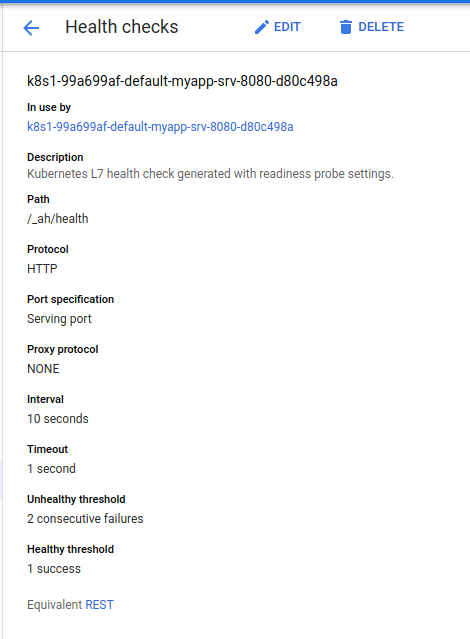

- 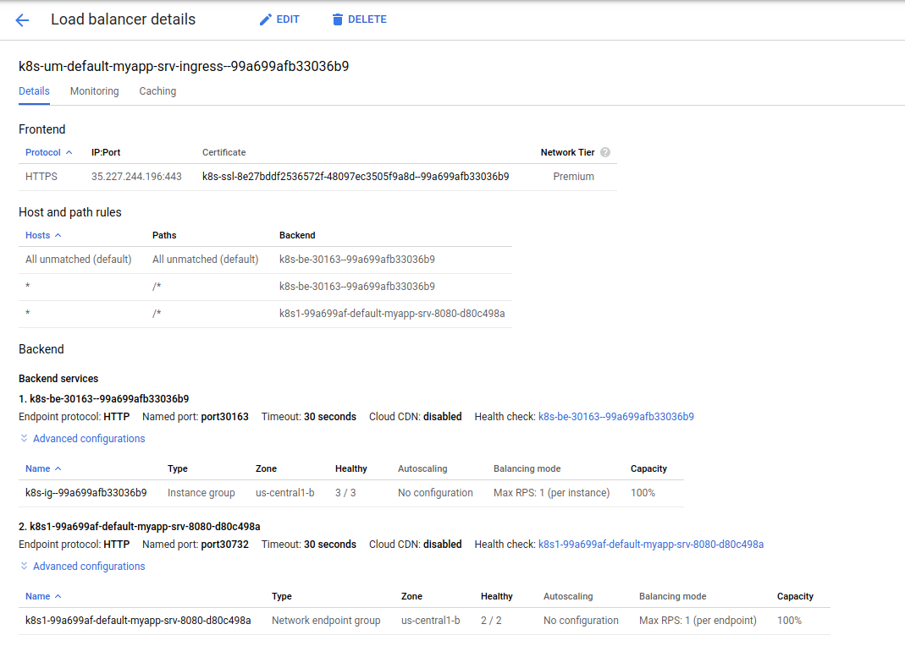


#### gRPC

alternatively, use:
 https://github.com/salrashid123/gcegrpc/blob/master/gke_ingress_lb/gke_ingress_lb_mux/fe-deployment.yaml


```yaml
---
apiVersion: v1
kind: Service
metadata:
  name: fe-srv-ingress
  labels:
    type: fe-srv
  annotations:
    cloud.google.com/app-protocols: '{"fe-web": "HTTP", "fe-grpc":"HTTP2"}'
    cloud.google.com/neg: '{"ingress": true }'
spec:
  type: NodePort
  ports:
  - name: fe-web
    port: 8080
    protocol: TCP
    targetPort: 8080
  - name: fe-grpc
    port: 443
    protocol: TCP
    targetPort: 50051
  selector:
    app: fe
```

- 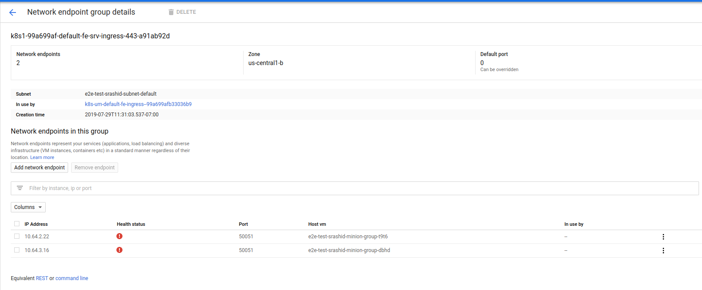

- 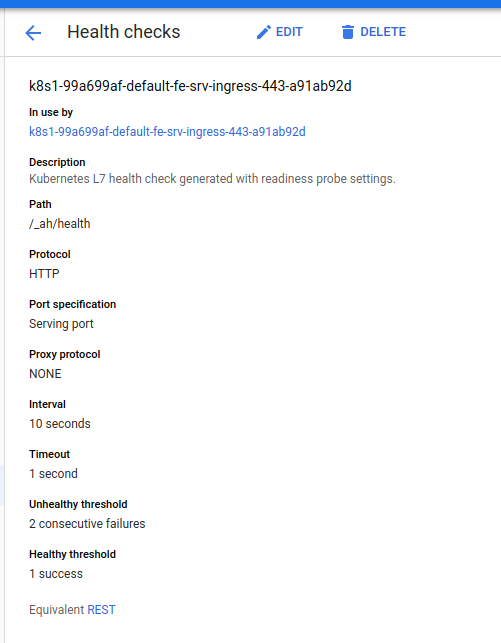

- 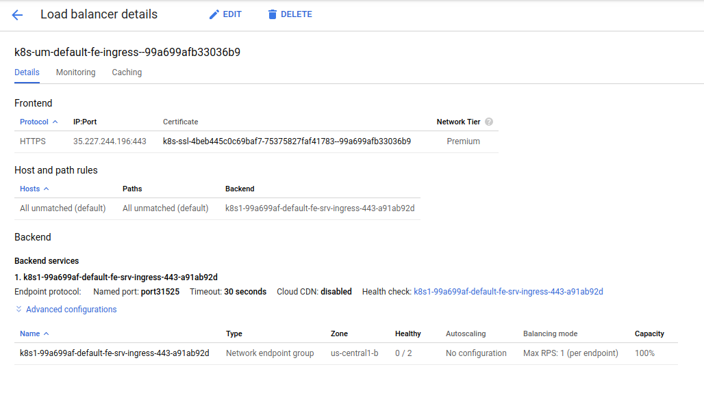

