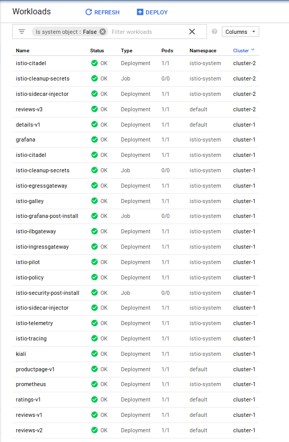
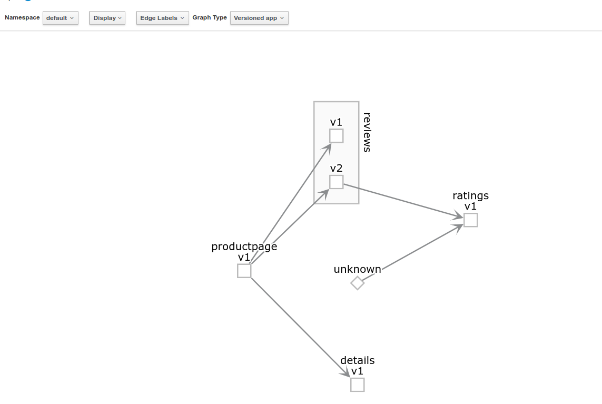
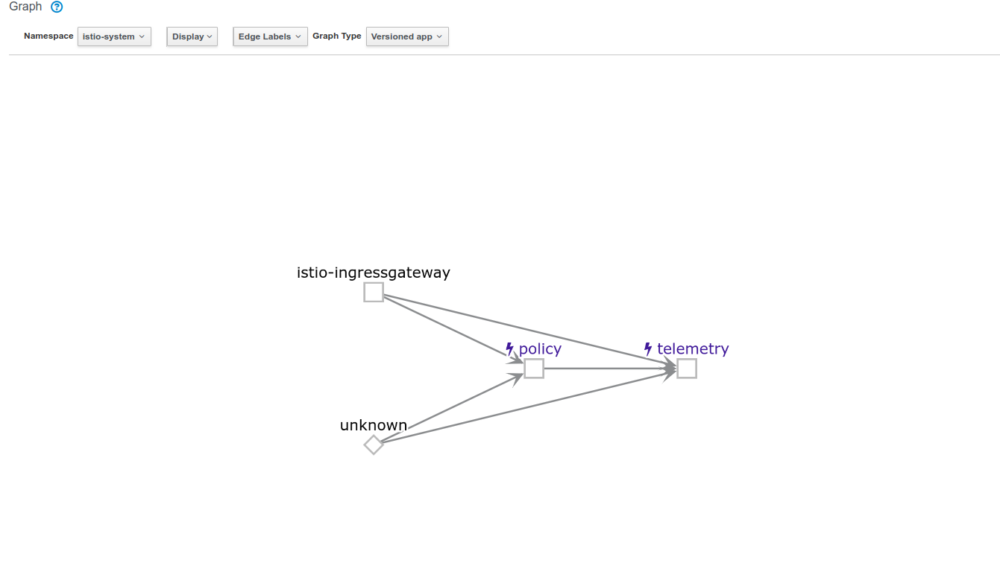

# Istio Multicluster

Setup steps for [Istio GKE Multicluster](https://istio.io/docs/examples/multicluster/gke/) with [Istio Bookinfo](https://istio.io/docs/examples/bookinfo/)

* Configure two GKE clusters with IStio in multi-cluster configuration in differnt GCP zones
* Deploy Bookinfo `reviews:v3` on remote cluster only

### Setup Env Variables

```bash
export proj=$(gcloud config get-value core/project)
export zone_1=us-central1-a
export zone_2=us-central1-b
```

### Create Clusters

- Master
```bash
gcloud container  clusters create cluster-1 --machine-type "n1-standard-2" --zone $zone_1  --num-nodes 4  --enable-ip-alias 
gcloud container clusters get-credentials cluster-1 --zone $zone_1
kubectl create clusterrolebinding cluster-admin-binding --clusterrole=cluster-admin --user=$(gcloud config get-value core/account)
kubectl create ns istio-system
```

- Remote

```bash
gcloud container  clusters create cluster-2 --machine-type "n1-standard-2" --zone $zone_2  --num-nodes 4  --enable-ip-alias 
gcloud container clusters get-credentials cluster-2 --zone $zone_2
kubectl create clusterrolebinding cluster-admin-binding --clusterrole=cluster-admin --user=$(gcloud config get-value core/account)
kubectl create ns istio-system
```

### Get Istio

```bash
export ISTIO_VERSION=1.0.5
wget https://github.com/istio/istio/releases/download/$ISTIO_VERSION/istio-$ISTIO_VERSION-linux.tar.gz
tar zxf istio-$ISTIO_VERSION-linux.tar.gz
```

### Bootstrap Remote

```bash
function join_by { local IFS="$1"; shift; echo "$*"; }
ALL_CLUSTER_CIDRS=$(gcloud container clusters list --format='value(clusterIpv4Cidr)' | sort | uniq)
ALL_CLUSTER_CIDRS=$(join_by , $(echo "${ALL_CLUSTER_CIDRS}"))
ALL_CLUSTER_NETTAGS=$(gcloud compute instances list --format='value(tags.items.[0])' | sort | uniq)
ALL_CLUSTER_NETTAGS=$(join_by , $(echo "${ALL_CLUSTER_NETTAGS}"))
gcloud compute firewall-rules create istio-multicluster-test-pods \
  --allow=tcp,udp,icmp,esp,ah,sctp \
  --direction=INGRESS \
  --priority=900 \
  --source-ranges="${ALL_CLUSTER_CIDRS}" \
  --target-tags="${ALL_CLUSTER_NETTAGS}" --quiet
```


### Install Istio on Master

```bash
kubectl config use-context "gke_${proj}_${zone_1}_cluster-1"
```

```bash
helm init --client-only
helm template istio-$ISTIO_VERSION/install/kubernetes/helm/istio --name istio --namespace istio-system \
   --set prometheus.enabled=true \
   --set grafana.enabled=true \
   --set tracing.enabled=true \
   --set sidecarInjectorWebhook.enabled=true \
   --set gateways.istio-ilbgateway.enabled=true \
   --set global.mtls.enabled=false  > istio_master.yaml
```

```bash
kubectl apply -f istio_master.yaml
kubectl label namespace default istio-injection=enabled
```

#### (optional) Install Kiali on Master

```bash
export USERNAME=$(echo -n 'admin' | base64)
export PASSPHRASE=$(echo -n 'admin' | base64)
export NAMESPACE=istio-system

echo '
apiVersion: v1
kind: Secret
metadata:
  name: kiali
  namespace: $NAMESPACE
  labels:
    app: kiali
type: Opaque
data:
  username: $USERNAME
  passphrase: $PASSPHRASE           
' | envsubst > kiali_secret.yaml
```

```bash
kubectl apply -f kiali_secret.yaml

export KIALI_OPTIONS=" --set kiali.enabled=true "
KIALI_OPTIONS=$KIALI_OPTIONS"  --set kiali.dashboard.grafanaURL=http://localhost:3000"
KIALI_OPTIONS=$KIALI_OPTIONS" --set kiali.dashboard.jaegerURL=http://localhost:16686"
helm template istio-$ISTIO_VERSION/install/kubernetes/helm/istio --name istio --namespace istio-system $KIALI_OPTIONS  > istio_kiali.yaml

kubectl apply -f istio_kiali.yaml
```

### Configure Remote

```bash
export PILOT_POD_IP=$(kubectl -n istio-system get pod -l istio=pilot -o jsonpath='{.items[0].status.podIP}')
export POLICY_POD_IP=$(kubectl -n istio-system get pod -l istio=mixer -o jsonpath='{.items[0].status.podIP}')
export TELEMETRY_POD_IP=$(kubectl -n istio-system get pod -l istio-mixer-type=telemetry -o jsonpath='{.items[0].status.podIP}')
```

```bash
helm template istio-$ISTIO_VERSION/install/kubernetes/helm/istio-remote --namespace istio-system \
  --name istio-remote \
  --set global.remotePilotAddress=${PILOT_POD_IP} \
  --set global.remotePolicyAddress=${POLICY_POD_IP} \
  --set global.remoteTelemetryAddress=${TELEMETRY_POD_IP}  > istio-remote.yaml
```

```bash
kubectl config use-context "gke_${proj}_${zone_2}_cluster-2"
```

```bash
kubectl create ns istio-system
kubectl apply -f istio-remote.yaml
kubectl label namespace default istio-injection=enabled
```


### Acquire Remote Cluster specifications

```bash
export WORK_DIR=$(pwd)
CLUSTER_NAME=$(kubectl config view --minify=true -o "jsonpath={.clusters[].name}")
CLUSTER_NAME="${CLUSTER_NAME##*_}"
export KUBECFG_FILE=${WORK_DIR}/${CLUSTER_NAME}
SERVER=$(kubectl config view --minify=true -o "jsonpath={.clusters[].cluster.server}")
NAMESPACE=istio-system
SERVICE_ACCOUNT=istio-multi
SECRET_NAME=$(kubectl get sa ${SERVICE_ACCOUNT} -n ${NAMESPACE} -o jsonpath='{.secrets[].name}')
CA_DATA=$(kubectl get secret ${SECRET_NAME} -n ${NAMESPACE} -o "jsonpath={.data['ca\.crt']}")
TOKEN=$(kubectl get secret ${SECRET_NAME} -n ${NAMESPACE} -o "jsonpath={.data['token']}" | base64 --decode)

cat <<EOF > ${KUBECFG_FILE}
apiVersion: v1
clusters:
   - cluster:
       certificate-authority-data: ${CA_DATA}
       server: ${SERVER}
     name: ${CLUSTER_NAME}
contexts:
   - context:
       cluster: ${CLUSTER_NAME}
       user: ${CLUSTER_NAME}
     name: ${CLUSTER_NAME}
current-context: ${CLUSTER_NAME}
kind: Config
preferences: {}
users:
   - name: ${CLUSTER_NAME}
     user:
       token: ${TOKEN}
EOF
```

### Configure Master with remote Context

```bash
kubectl config use-context "gke_${proj}_${zone_1}_cluster-1"
kubectl create secret generic ${CLUSTER_NAME} --from-file ${KUBECFG_FILE} -n ${NAMESPACE}
kubectl label secret ${CLUSTER_NAME} istio/multiCluster=true -n ${NAMESPACE}
```

### Deploy Bookinfo to Master

```bash
kubectl config use-context "gke_${proj}_${zone_1}_cluster-1"
kubectl apply -f istio-$ISTIO_VERSION/samples/bookinfo/platform/kube/bookinfo.yaml
kubectl apply -f istio-$ISTIO_VERSION/samples/bookinfo/networking/bookinfo-gateway.yaml
```

### Delete `reviews-v3` on Master

```bash
kubectl delete deployment reviews-v3
```

### Deploy `reviews-v3` only on Remote

```bash
cat <<EOF > reviews-v3.yaml
---
##################################################################################################
# Ratings service
##################################################################################################
apiVersion: v1
kind: Service
metadata:
  name: ratings
  labels:
    app: ratings
spec:
  ports:
  - port: 9080
    name: http
---
##################################################################################################
# Reviews service
##################################################################################################
apiVersion: v1
kind: Service
metadata:
  name: reviews
  labels:
    app: reviews
spec:
  ports:
  - port: 9080
    name: http
  selector:
    app: reviews
---
apiVersion: extensions/v1beta1
kind: Deployment
metadata:
  name: reviews-v3
spec:
  replicas: 1
  template:
    metadata:
      labels:
        app: reviews
        version: v3
    spec:
      containers:
      - name: reviews
        image: istio/examples-bookinfo-reviews-v3:1.5.0
        imagePullPolicy: IfNotPresent
        ports:
        - containerPort: 9080
EOF
```

```bash
kubectl config use-context "gke_${proj}_${zone_2}_cluster-2"
kubectl apply -f reviews-v3.yaml
```

---


### Verify MultiCluster


- Master
```
$ kubectl config use-context "gke_${proj}_${zone_1}_cluster-1"
Switched to context "gke_fabled-ray-104117_us-central1-a_cluster-1".

$ export GATEWAY_IP=$(kubectl -n istio-system get service istio-ingressgateway -o jsonpath='{.status.loadBalancer.ingress[0].ip}')
$ echo $GATEWAY_IP

$ kubectl get po,deployment
NAME                               READY     STATUS    RESTARTS   AGE
pod/details-v1-6865b9b99d-ws5zv    2/2       Running   0          5m
pod/productpage-v1-f8c8fb8-fmsnv   2/2       Running   0          5m
pod/ratings-v1-77f657f55d-nsc56    2/2       Running   0          5m
pod/reviews-v1-6b7f6db5c5-mhqz6    2/2       Running   0          5m
pod/reviews-v2-7ff5966b99-xdj4f    2/2       Running   0          5m

NAME                                   DESIRED   CURRENT   UP-TO-DATE   AVAILABLE   AGE
deployment.extensions/details-v1       1         1         1            1           5m
deployment.extensions/productpage-v1   1         1         1            1           5m
deployment.extensions/ratings-v1       1         1         1            1           5m
deployment.extensions/reviews-v1       1         1         1            1           5m
deployment.extensions/reviews-v2       1         1         1            1           5m
```

- Remote

```
$ kubectl config use-context "gke_${proj}_${zone_2}_cluster-2"
Switched to context "gke_fabled-ray-104117_us-central1-b_cluster-2".

$ kubectl get po,deployment
NAME                              READY     STATUS    RESTARTS   AGE
pod/reviews-v3-6bc884b456-nkzzz   2/2       Running   0          2m

NAME                               DESIRED   CURRENT   UP-TO-DATE   AVAILABLE   AGE
deployment.extensions/reviews-v3   1         1         1            1           2m
```




Send Traffic to `/productpage` and observe if the `ratings:v3` is called (you'll know if it is if you see `red` stars on [Bookinfo](https://istio.io/docs/examples/bookinfo/)

There are 3 versions of the reviews microservice:

* Version v1 doesn’t call the ratings service.
* Version v2 calls the ratings service, and displays each rating as 1 to 5 black stars.
* Version v3 calls the ratings service, and displays each rating as 1 to 5 red stars.

### (optional) View Kiali Dashboard

In new window

```
kubectl config use-context "gke_${proj}_${zone_1}_cluster-1"

kubectl -n istio-system port-forward $(kubectl -n istio-system get pod -l app=kiali -o jsonpath='{.items[0].metadata.name}') 20001:20001
```

then `http://localhost:20001` to access the dashboard (username/password:  `admin`/`admin`)






* Traffic to `cluster-2 - reviews:v3` is not shown.
* Traffic from `cluster-2:reviews:v3` --> ``cluster-1:ratings:v2` shows as originatinf from `unknown`

### Delete

```
gcloud compute firewall-rules delete istio-multicluster-test-pods -q
gcloud container clusters delete cluster-1 --zone $zone_1 -q
gcloud container clusters delete cluster-2 --zone $zone_2 -q
```