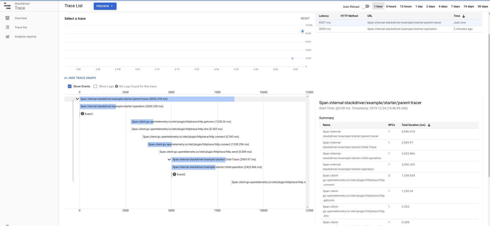

# Simple distributed tracing with OpenTracing and Stackdriver

- my variation of

[https://github.com/open-telemetry/opentelemetry-go/tree/master/example/http-stackdriver](https://github.com/open-telemetry/opentelemetry-go/tree/master/example/http-stackdriver)


### 1. Setup

```bash
gcloud auth application-default login
export PROJECT_ID=`gcloud config get-value core/project`


gsutil mb gs://$PROJECT_ID-ot/
echo foo > file.txt
gsutil cp file.txt gs://$PROJECT_ID-ot/
```

## 2. Server

```bash
export PROJECT_ID=`gcloud config get-value core/project`
export OT_BUCKET=$PROJECT_ID-ot

cd server/
go run main.go
```


## 3. Client

```bash

export PROJECT_ID=`gcloud config get-value core/project`
export OT_BUCKET=gs://$PROJECT_ID-ot/

cd client/
go run main.go
```


### Invoke

```
curl http://localhost:8080/frontend
```

---



