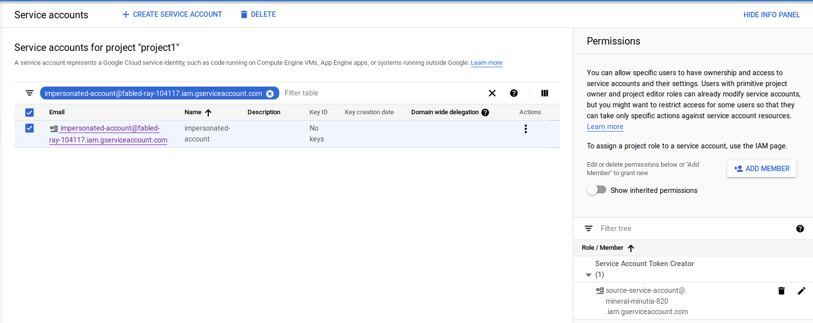
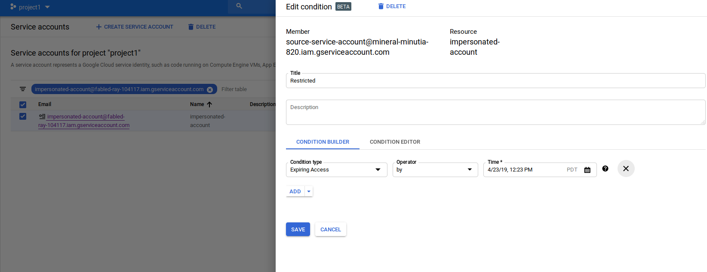
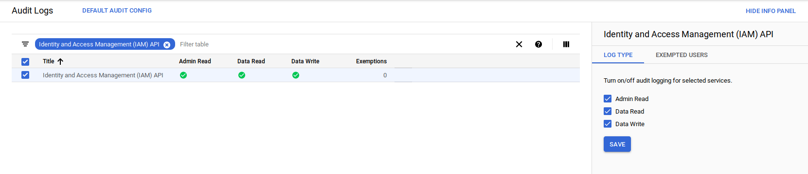
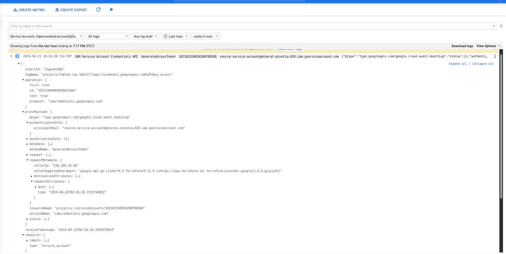

# Terraform "Assume Role" and service Account impersonation on Google Cloud

About two months ago, someone asked me to help them setup [Terraform](https://www.terraform.io/) to automatically [provision GCP projects](https://cloud.google.com/community/tutorials/managing-gcp-projects-with-terraform). It was the first time I actually used it and found it capabilities pretty powerful: it's easy to manage complex resources and maintain a picture of the state change. However, one aspect of its capabilities that struck me was its need to directly have permissions on all GCP resources it provisioned or manage. At first glance this may seem pretty obvious ("how can I create a Pub/Sub topic on project B if I don't have access to it?"), but the issue I had with it is a bit more subtle: How can I selectively control that access in a way which I can define the conditions on the access and easily manage Terraform's permissions as a group.

Put it another way, traditionally, if Terraform runs as `service_account_A` from `project_A` and it needs to create a GCS bucket in `project_B` that I own, I'd have to either give it excessive privileges by setting its service account as `OWNER` or directly assign a [role](https://cloud.google.com/iam/docs/understanding-roles#storage-roles) to `serivce_account_A` on my project as `roles/storage.admin`. What if I needed to also allow it to create a Pub/Sub topic in the same script or some role with Compute Engine? Now I have to assign additional roles to service_account_A and remember to roll them back after Terraform does its provisioning. As you can see, it can get out of hand if you have to manage it all manually.

Well, what if I can create service account in the project I own and with those roles aggregated already set and then allow Terraform's `service_account_A` to impersonate it? That way, I've collapsed and specified the permissions I needed to one identity (the service account I created), and then allowed Terraform access to it under any [IAM conditions](https://cloud.google.com/iam/docs/conditions-overview) I wish.

If you're familiar with AWS, another way to think about what we're trying to do with this is to have [AWS Assume Role](https://www.terraform.io/docs/providers/aws/index.html#assume-role) where Terraform assumes a specific role capable of access to resources I control.


Given that objective I decided place a pull request ([#3211](https://github.com/terraform-providers/terraform-provider-google/pull/3211)) against the GCP provider to implement the account impersonation flows I previously added to the [google-auth-library-python](https://google-auth.readthedocs.io/en/latest/reference/google.auth.impersonated_credentials.html) and [google-auth-library-java](https://github.com/googleapis/google-auth-library-java/blob/master/oauth2_http/java/com/google/auth/oauth2/ImpersonatedCredentials.java) library sets.  For more info see [Using ImpersonatedCredentials for Google Cloud APIs](https://medium.com/google-cloud/using-impersonatedcredentials-for-google-cloud-apis-14581ca990d8)

The net result is the [Google Access Token](https://www.terraform.io/docs/providers/google/d/datasource_google_service_account_access_token.html) datasource in Terraform...and as you guessed, this article describes is usage.

# Prerequisites

This article assumes you're already familiar with Terraform and use it to manage resource provisioning. The steps below will show how to setup the IAM permission sets and a sample template that will display the original and assumed identity that was bootstrapped.

## Add IAM Permission

First let's setup the IAM permissions that allows impersonation. In the sample below, `source-service-account` designates the service account Terraform runs as, and `impersonated-account` is the service account on the target project where Terraform should conditionally assume access to.

This involves assigning the `Service Account Token Creator` Role:

- `service_policy.json`
```
{
    "bindings": [
    {
      "members": [
        "source-service-account@projectA.iam.gserviceaccount.com"
      ],
      "role": "roles/iam.serviceAccountTokenCreator",
    }
  ]
}
```

then run

```bash
$ gcloud iam service-accounts set-iam-policy  impersonated-account@projectB.iam.gserviceaccount.com  service_policy.json
```




## Test

To test, I configure Terraform to use the source-service-account:

```
export GOOGLE_CLOUD_KEYFILE_JSON=/local/path/to/source-service-account.json
```

Then, I specify a configuration which uses the source-service-account email to assume the identity of the impersonated-account with an aliased provider. Any Terraform resources which reference that aliased provider will use the impersonated-account.

```terraform
provider "google" {
    scopes = [
    "https://www.googleapis.com/auth/cloud-platform",
    "https://www.googleapis.com/auth/userinfo.email",
  ]
}

data "google_service_account_access_token" "default" {
 provider = "google"
 target_service_account = "impersonated-account@projectB.iam.gserviceaccount.com"
 scopes = ["userinfo-email", "cloud-platform"]
 lifetime = "300s"
}

data "google_client_openid_userinfo" "me" { }

output "source-email" {
  value = "${data.google_client_openid_userinfo.me.email}"
}

provider "google" {
   alias  = "impersonated"
   access_token = "${data.google_service_account_access_token.default.access_token}"
}

data "google_client_openid_userinfo" "thenewme" {
  provider = "google.impersonated"
}

output "target-email" {
  value = "${data.google_client_openid_userinfo.thenewme.email}"
}
```


The sample output for the above would show
```bash
terraform apply
data.google_client_openid_userinfo.me: Refreshing state...
data.google_service_account_access_token.default: Refreshing state...
data.google_client_openid_userinfo.thenewme: Refreshing state...

Apply complete! Resources: 0 added, 0 changed, 0 destroyed.

Outputs:

source-email = source-service-account@projectA.iam.gserviceaccount.com
target-email = impersonated-account@projectB.iam.gserviceaccount.com
```

The example above doesn't really do anything to alter actual state as the impersonated credentials but you can easily use other Terraform resources to do so (just remember to specify `provider = "google.impersonated"` in each resource). In real usage, you control the specific resources the impersonated service account has access to. For example, if all Terraform should do is create GCS buckets in your project, assign the appropriate role to the service account that will be impersonated (i.,e. assign `roles/storage.admin` to `impersonated-account@projectB.iam.gserviceaccount.com` )

## Notes:

- GCP IAM conditions are eventually consistent in that once you make an IAM change (eg, to allow impersonation), it may take up to `60 seconds` for the changes to propagate.

- If you grant access to Terraform to initially create resources in your project and the access gets revoked, Terraform can't make any further changes; this is as intended but may lead to drift in the state that Terraform sees as resources to manage versus what it can actually alter.

- Impersonated tokens are *NOT* refreshable: Once an impersonate token is issued, it is not refreshed once it expires. If you set the `duration` argument for `30s` in the example above, Terraform will not be able to impersonate the target account after 30 seconds or so

## Usage arguments

The following list describes the arguments the resource accepts:
* `lifetime`: how long the temporary access will be valid for. Service token is **not** refreshed once it expires.
* `scopes`: list of scopes the impersonation identity `access_token` can enlist.
* `target_service_account`: the account to impersonate
* `delegates`:  list of service accounts in sequence that need to successively have token creator roles on the successor.

## IAM Conditions

Up until now, the capability describe simply shows how to grant indefinite access to impersonate. That's useful but in conjunction with [IAM Conditions](https://cloud.google.com/iam/docs/conditions-overview), it's even more compelling.

IAM Conditions allows you to declare the specific criteria under which an IAM permission on a resource is allowed: you can say, "only allow Terraform to impersonate my service account during 1->2am on April 10th". With these high level policies, you can define a type of "just in time" access controls through workflow systems: define when the Terraform script will run to provision or alter resources you control!

As of `2019-04-20`, you can only setup IAM conditions that are time based for the `IAMCredentials` API. This means the service account impersonation capability with IAM conditions is restricted only by time. Later on, GCP will add on support for the other condition types such as restricting via VPC network or based on IP origin.

For example, future support will involve policies covering:

* [VPC Service Controls](https://cloud.google.com/vpc-service-controls/docs/create-service-perimeters)
* `AccessContext/AccessLevels`
  The following condition will allow Terraform to only impersonate your service account before 2019-04-20 and only if the request to impersonate originates from IP address `73.162.112.208/32`

```bash
$ gcloud beta access-context-manager levels describe  Medium_Trusted  --policy 157300459203
basic:
  conditions:
  - ipSubnetworks:
    - 73.162.112.208/32
  - members:
    - serviceAccount:source-service-account@projectA.iam.gserviceaccount.com
name: accessPolicies/157300459203/accessLevels/Medium_Trusted
title: corporate network


$ gcloud iam service-accounts get-iam-policy  impersonated-account@projectB.iam.gserviceaccount.com
bindings:
- condition:
    expression: |
      "accessPolicies/157300459203/accessLevels/Medium_Trusted" in request.auth.access_levels
      &&
      request.time < timestamp("2019-04-20T00:00:00Z")
    title: network_and_time_restricted
  members:
  - serviceAccount:source-service-account@projectA.iam.gserviceaccount.com
  role: roles/iam.serviceAccountTokenCreator
```



Note: you can actually apply IAM conditions against downstream resources the impersonated account manges itself (i.e. IAM conditions on the access `impersonated-account@projectB.iam.gserviceaccount.com` has against resources). If you do this, it may make debugging why Terraform isn't able to manage resources a bit more difficult to troubleshoot: you're now dealing with levels of conditional access.

## Audit Log

You can also enable GCP Audit logging that will track the initial impersonation call. For example, if you enable Audit Logging for IAM APis:



an impersonation request will appear in the logs as such:



Note, you can also enable audit logging on the target resources such as GCS or Compute Engine as well but those logs will currently not display what the source service account was that was being impersonated (eg, the resource was mutated on behalf of `source-service-account`)

## Conclusion

While this capability is relatively easy to use and setup (just grant Terraform IAM permission to `act-as`), the implications of acutely controlling remote resources is pretty compelling: a terraform installation can manage resources in remote projects or organizations without persistent and explicit grants...an administrator of another organization can also control and scope limit the access it grants to Terraform you manage!.

## References

* [Google Cloud Platfrom Provider](https://www.terraform.io/docs/providers/google/index.html)
* [AWS Assume Role](https://www.terraform.io/docs/providers/aws/index.html#assume-role)
