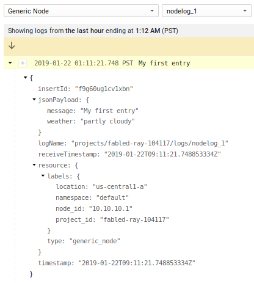
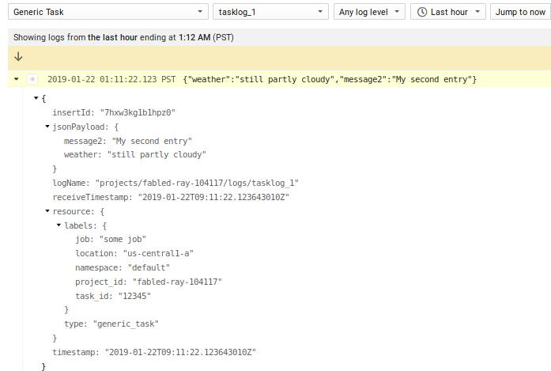
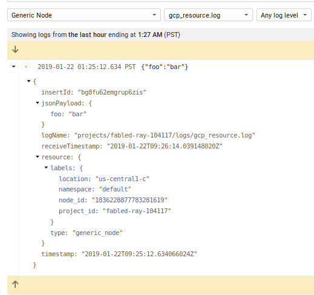
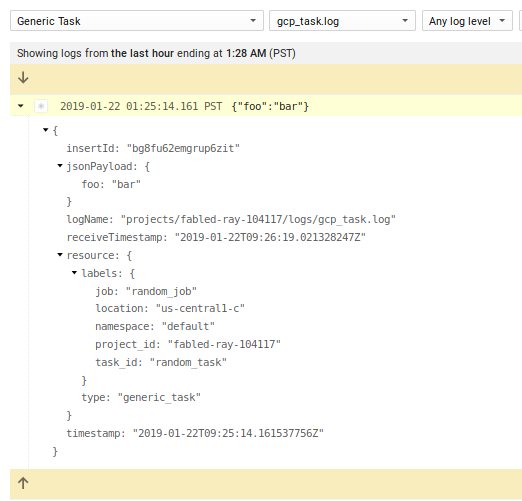
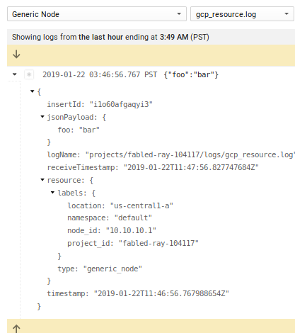
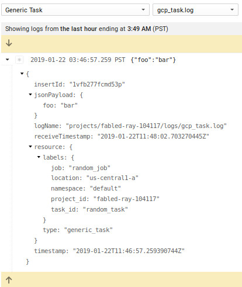
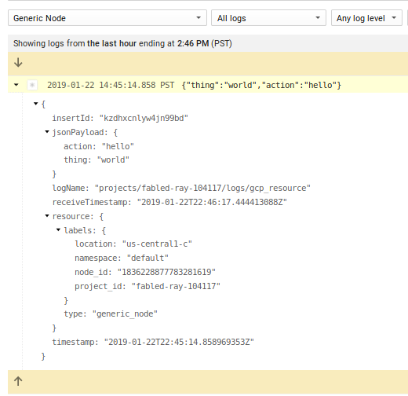
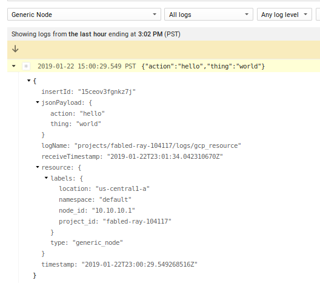
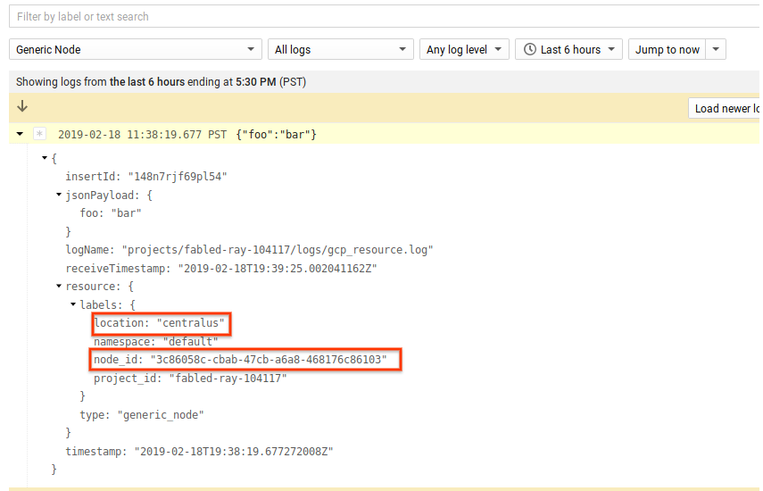

# Writing Developer logs with Google Cloud Logging

Several months ago Google Cloud Logging introduced two new [monitored resource](https://cloud.google.com/logging/docs/basic-concepts#monitored-resources) types geared towards allowing developers to emit cloud logging messages for their own application centric logs.  Pereviously, application logs generally had to be tied to existing predefined `monitored_resources` such as `GCE`, `GKE`, `AppEngine`, `Dataflow` and so on.  Under those monitoried resources sources, multiple log entries were attributed to specific `logNames` describing the subsystem like `syslog`, `apache2`, `nginx`, `mysql`, etc.  In the end, the `monitored_resource` defined the source system and the `logName` the source application/system.

What if you wanted to emit your own application logs that allows you to define a generic source resource or task _and_ the logName?  In other words, have a monitoired resource that specifically doens't prescribe the source system and process withing that but allows you to define describe your own.  Thats where the new `generic_node` and `generic_task` resource types come in. These new resource types can be thought of as a generic source system that represents where your application runs (`generic_node`) and the specific instance of your application (`generic_task`).

This article will describe the two new types and how to send log to GCP using both the GCP Logging API, the GCP logging agent and finally the off the shelf `fluentd` agent alone.

So...what are these two new types?

## Generic Node

Taken from the documentation:

- [Generic Node](https://cloud.google.com/monitoring/api/resources#tag_generic_node):

> "A generic node identifies a machine or other computational resource for which no more specific resource type is applicable. The label values must uniquely identify the node."

under which you can define some lables:

* `project_id`: The identifier of the GCP project associated with this resource, such as "my-project".
* `location`: The GCP or AWS region in which data about the resource is stored. For example, "us-east1-a" (GCP) or "aws:us-east-1a" (AWS).
* `namespace`: A namespace identifier, such as a cluster name.
* `node_id`: A unique identifier for the node within the namespace, such as a hostname or IP address. 

## Generic Task

Taken from the documentation:

- [Generic Task](https://cloud.google.com/monitoring/api/resources#tag_generic_task):

> "A generic task identifies an application process for which no more specific resource is applicable, such as a process scheduled by a custom orchestration system. The label values must uniquely identify the task."

* `project_id`: The identifier of the GCP project associated with this resource, such as "my-project".
* `location`: The GCP or AWS region in which data about the resource is stored. For example, "us-east1-a" (GCP) or "aws:us-east-1a" (AWS).
* `namespace`: A namespace identifier, such as a cluster name.
* `job`: An identifier for a grouping of related tasks, such as the name of a microservice or distributed batch job.
* `task_id`: A unique identifier for the task within the namespace and job, such as a replica index identifying the task within the job. 


> **NOTE**: while you can set the `location` attribute to anything you want, if it not one of the GCE or EC2 `zones`, then [logs-to-metrics](https://cloud.google.com/logging/docs/logs-based-metrics/) with that attribute will not work (as of 2/13/19). However, it maybe possible to emit logs and still have metrics if the `location` and `vmID` matches an existing VM  running on GCP (I havne't confirmed that yet though).

## Sending Logs

This article will show how to send `generic_task` and `generic_node` logs via

* Cloud Logging API
  - Emit logs via the API from anywhere.
  - Requires [Authentication Default Credentials](https://cloud.google.com/docs/authentication/production).

* Cloud Logging Agent
  - Supported on GCE/EC2 and uses `google-fluentd`,
  - Can acquire authentication credentials from `metadata sever` on GCE.
  - Requires authentication credentials file on EC2.

* Generic fluentd
  - Supported anywhere `fluentd` runs.
  - Requires authentication credentials file.

If you are running on GCE or EC2, the `Cloud Logging Agent` would be the best bet.  If you are already using `fluentd` elsewhere, just add the `fluent-plugin-google-cloud` gem then add on the forked `out_google_cloud.rb` as describe a bit below.

>> **NOTE** as of `2/5/19`, the changes needed to support `generic_node` and `generic_task` is NOT included in the fluent plugin for google cloud stackdriver.  However, the changes are relatively simple so I've _forked_ [fluent-plugin-google-cloud](https://github.com/GoogleCloudPlatform/fluent-plugin-google-cloud) and added in the changes here:
[https://github.com/salrashid123/fluent-plugin-google-cloud](https://github.com/salrashid123/fluent-plugin-google-cloud).  The only real change is to [out_google_cloud.rb](https://github.com/GoogleCloudPlatform/fluent-plugin-google-cloud/blob/master/lib/fluent/plugin/out_google_cloud.rb).  I'll keep sync with upstream every week or so to keep it uptoday.   Ofcourse to be clear, this for is *NOT supported by google cloud*

For refernece, here are some related articles on Cloud Logging I tried out over the year:
  - [Apache/Nginx Structured Logs with Cloud Logging Agent](https://medium.com/google-cloud/envoy-nginx-apache-http-structured-logs-with-google-cloud-logging-91fe5965badf)
  - [Flask Logging plugin for Combined logs](https://github.com/salrashid123/flask-gcp-log-groups)
  - [Combining correlated Log Lines in Google Stackdriver](https://medium.com/google-cloud/combining-correlated-log-lines-in-google-stackdriver-dd23284aeb29)
  - [auditd agent config for Stackdriver Logging](https://medium.com/google-cloud/auditd-agent-config-for-stackdriver-logging-c27d1431ed3a)
  - [Envoy Proxy fluentd parser](https://github.com/salrashid123/fluent-plugin-envoy-parser)
  - [Fluentd filter plugin for Google Cloud Data Loss Prevention API](https://github.com/salrashid123/fluent-plugin-gcp-dlp-filter)

Anyway...

### Cloud Logging API

The cloud logging API is pretty simple to use.  First setup `Appplication Default Credentials` by running `gcloud auth application-default login`.  Then alter the `project_id` setting below and execute the script

```python
from google.cloud import logging
from google.cloud.logging.resource import Resource

client = logging.Client()

logger = client.logger('nodelog_1')
r = Resource("generic_node", labels={
    'project_id':'fabled-ray-104117',
    'location': 'us-central1-a',
    'namespace': 'default',
    'node_id': '10.10.10.1'})
logger.log_struct(
    {"message": "My first entry", "weather": "partly cloudy"}, resource=r
)


logger = client.logger('tasklog_1')
r = Resource("generic_task",  labels={
    'location': 'us-central1-a',
    'namespace': 'default',
    'job':'some job',
    'task_id': '12345'} )
logger.log_struct(
    {"message2": "My second entry", "weather": "still partly cloudy"}, resource=r
)
```
Gives:

- 

and 

- 

## Cloud Logging Agent

More common than the API, Cloud Logging reads log files on source systems and emits them to GCP via a logging agent or a fluentd plugin.  While on GCE or EC2 instances, the [cloud logging agent](https://cloud.google.com/logging/docs/agent/) provides easy installation and [several pre-built configuration](https://github.com/GoogleCloudPlatform/fluentd-catch-all-config) to emit formatted log to GCP.  If the source system is running off the shelf `fluentd`, the cloud logging integration can be added in by simply applying the  [flutnet-plugin-google-cloud](https://github.com/GoogleCloudPlatform/fluent-plugin-google-cloud) gem.

First we will install the `cloud logging agent` on GCE and then the `fluent-plugin-google-cloud` on generic, stand-alone `fluentd`.  This article does not show the installation steps on AWS and the links above describe its setup.

### GCE

1) Create VM with `Logging Writer` scope enabled

2) `ssh` to the VM and install the structured logging agent

```
curl -sSO "https://dl.google.com/cloudagents/install-logging-agent.sh"
sudo bash install-logging-agent.sh --structured
```

```
/opt/google-fluentd/embedded/bin/gem list fluent-plugin-google-cloud
    fluent-plugin-google-cloud (0.7.5)

export GOOGLE_PLUGIN_VERSION="0.7.5"

wget  https://raw.githubusercontent.com/salrashid123/fluent-plugin-google-cloud/master/lib/fluent/plugin/out_google_cloud.rb \
       -O /opt/google-fluentd/embedded/lib/ruby/gems/2.4.0/gems/fluent-plugin-google-cloud-$GOOGLE_PLUGIN_VERSION/lib/fluent/plugin/out_google_cloud.rb
```

3) Add configuration to `/etc/google-fluentd/google-fluentd.conf`

> Note: the `@type http` was added in just for testing; in real usecases, you will setup the log file source as described at the end of this article.

```
<source>
  @type http
  @id input_http
  port 8888
</source>
<filter gcp_resource.**>
  @type record_transformer
  @log_level debug
  <record>
    "logging.googleapis.com/local_resource_id" "generic_node..default."
  </record>
</filter>
<match gcp_resource.**>
  @type google_cloud
  @log_level debug
</match>

<filter gcp_task.**>
  @type record_transformer
  @log_level debug
  <record>
    "logging.googleapis.com/local_resource_id" "generic_task..default.randomjob.randomtaskid"
  </record>
</filter>
<match gcp_task.**>
  @type google_cloud
  @log_level debug
</match>
```

If you would rather specify the `zone` and represent the node name you prevfer other than the GCE/EC2/Azure `vmid`, simply specify that value:

eg:
```
 "logging.googleapis.com/local_resource_id" "generic_node.LOCATION.default.HOST"
```

Again, if you omit speecifying the `location` or `node`, the plugin will attempt to derive those values while running on GCP, AWS or Azure.

4) Restart `google-fluentd`

```
 service google-fluentd restart
```

5) Send sample traffic to http test source:

```
curl -X POST -d 'json={"foo":"bar"}' http://localhost:8888/gcp_resource.log
curl -X POST -d 'json={"foo":"bar"}' http://localhost:8888/gcp_task.log
```

Give about 30seconds, you should see the lines indicating the logs were transmitted to google
`/var/log/google-fluentd/google-fluentd.log`


6) Check cloud logging console for output under `Generic Node` and `Generic Task`

Note that in the screenshot below, the `node_id` is actually the VM's id derived from the GCP Metadataserver.  You can use that nodeid to correlate other for this particular VM.

- 

- 


Note that in the configuration above we did not define the `node_id` or `location`.  If those settings are not specified the google fluentd agent will automatically try to derive the values from GCE or EC2 metadata server.  In the example above, the GCE vm_id is uses as the `node_id`.


### Fluentd

The following describes installing [fluent-plugin-google-cloud](https://github.com/GoogleCloudPlatform/fluent-plugin-google-cloud) into generic `fluentd`:

1) Create a `service_account` and JSON key on a GCP project.
2) Assign IAM role _Logging Writer_ to that service account
3) Download JSON cert and rename the file to `application_default_credentials.json`

if you want to test this with a local docker image, copy the credential to a folder under the current directory  called `certs` and run

`docker run -ti  -p 8888:8888 -v `pwd`/certs/:/etc/google/auth/ debian:stretch /bin/bash`
then
`apt-get update && apt-get install curl wget sudo make vim gcc gnupg2 -y`

(yes, i know, gcc, make; the `gem install` command there build the fluent library from scratch with grpc support.  There has to be a way to package all of it directly without users needed to add those packages;  its a TODO for me after i understand ruby a bit better..)

4) Install `fluentd` on the target system (in this case `debian-stretch`))

```
  curl -L https://toolbelt.treasuredata.com/sh/install-debian-stretch-td-agent3.sh | sh
```

5) Install `fluent-plugin-google-cloud` gem

```
  /opt/td-agent/embedded/bin/gem install fluent-plugin-google-cloud
```

6) Add certificate and change permisssions

  Copy  `application_default_credentials.json` to the target system as `/etc/google/auth/application_default_credentials.json` and change permissions:

```bash
  chown td-agent:td-agent /etc/google/auth/application_default_credentials.json
  chmod go-rwx /etc/google/auth/application_default_credentials.json

  ls -lart /etc/google/auth/application_default_credentials.json
  -rw-r----- 1 td-agent td-agent 2332 Jan 16 20:52 /etc/google/auth/application_default_credentials.json
```

7) Install `out_google_cloud.rb` from fork repository

```
/opt/td-agent/embedded/bin/gem  list fluent-plugin-google-cloud
    fluent-plugin-google-cloud (0.7.5)
```

so export the verison and copy the fork
```
export GOOGLE_PLUGIN_VERSION="0.7.5"
wget  https://raw.githubusercontent.com/salrashid123/fluent-plugin-google-cloud/master/lib/fluent/plugin/out_google_cloud.rb \
       -O /opt/td-agent/embedded/lib/ruby/gems/2.4.0/gems/fluent-plugin-google-cloud-0.7.5/lib/fluent/plugin/out_google_cloud.rb
```

7) Configure fluentd
  Edit `/etc/td-agent/td-agent.conf` and configurations for `generic_node` and `generic_task`:

```
<filter gcp_resource.**>
  @type record_transformer
  @log_level debug
  <record>
    "logging.googleapis.com/local_resource_id" "generic_node.us-central1-a.default.somehost"
  </record>
</filter>
<match gcp_resource.**>
  @type google_cloud
  use_metadata_service false
  @log_level debug
</match>

<filter gcp_task.**>
  @type record_transformer
  @log_level debug
  <record>
    "logging.googleapis.com/local_resource_id" "generic_task.us-central-1.default.randomjob.randomtaskid"
  </record>
</filter>
<match gcp_task.**>
  @type google_cloud
  use_metadata_service false  
  @log_level debug
</match>
```

> again, we're using  a test `@type http` source just as a demo.

8) Restart fluentd

```
  service td-agent restart
```

- Send sample traffic to http listener

```
  curl -X POST -d 'json={"foo":"bar"}' http://localhost:8888/gcp_resource.log
  curl -X POST -d 'json={"foo":"bar"}' http://localhost:8888/gcp_task.log
```

tail the logfile at `/var/log/td-agent/td-agent.log`  (wait about a minute until the agent flushes the logs to stackdriver)

9) Check cloud logging console for output under `Generic Node` and `Generic Task`

- 

- 

> **Note** If you do not not define the `node_id` or `location` and run on GCE or EC2, the plugin will attempt to automatically try to derive the values from GCE or EC2 metadata server for the`vm_id` as the `node_id` and `zone` as `location`.

## Reading Developer logs from arbitrary files

The example above we setup the cloud logging agent for GCE and the plugin for fluentd but used a test debug handler to source logs (`@type http`).  In the following configuration, we'll use an actual log file (eg. `/var/log/node_logs.log`) (which is what you'd likely do in production).  The following isn't anything specific to `google-fluentd` but rather just plain fluentd configuration for log sources (i've added in the section in to show a more realistic example than `@type http`).

### GCE

In this example all we are doing is setting up a log file to track and taged as `gcp_resource` which in our config is handled by `google_cloud` as a `generic_node`:

- `/etc/google-fluentd/google-fluentd.conf`

```
  <match gcp_resource.**>
    @type google_cloud
    monitored_resource generic_node
    namespace default
  </match>
```

- `/etc/google-fluentd/config.d/mynode.conf`

```
  <source>
    @type tail
    format /(?<action>\w+) (?<thing>\w+)/
    tag gcp_resource
    read_from_head true
    path /var/log/node_logs.log
    pos_file /var/lib/google-fluentd/pos/node_logs.pos
  </source>
```

> note, i've seutp a regex parse the logs as JSON as shown in the link below

then

```
echo "hello world" > /var/log/node_logs.log
```

gives

- 

For more info see [Writing your own parser](https://cloud.google.com/logging/docs/structured-logging#writing_your_own_parser) and [Customizing Agent Configuration](https://cloud.google.com/logging/docs/agent/configuration#configure)

### Fluentd

Edit  `/etc/td-agent/td-agent.conf` and add:

```
  <match gcp_resource.**>
    @type google_cloud
    use_metadata_service false
    monitored_resource generic_node
    location us-central1-a
    namespace default
    node_id 10.10.10.1
  </match>

  <source>
    @type tail
    format /(?<action>\w+) (?<thing>\w+)/
    tag gcp_resource
    read_from_head true
    path /var/log/node_logs.log
    pos_file /var/lib/td-agent/node_logs.pos
  </source>
```

(You my need to setup permissions for fluentd on the pos and log file: 
`chown td-agent:td-agent /var/lib/td-agent/node_logs.pos`)

then after restart of `td-agent`

```
echo "hello world" > /var/log/node_logs.log
```

You should see the logs in GCP assuming you setup a JSON certficate file into (`/etc/google/auth/application_default_credentials.json`)
- 


## Summary

You can use these new types to setup logs for your own applications and ingest them into `Google Cloud Logging`.  While you don't get truly 'top-level' resource types (your'e still dealing with the `generic_*` ones), you are free here to define what system and application that sources logs.

## Bonus Level: Azure

The forked repo also supports Azure metadata server (for details, see [commit](https://github.com/salrashid123/fluent-plugin-google-cloud/commit/e58ab8199d1fe6d5198c8090774a6d6c2c07b6d2)).  What this means is if you run fluentd on Azure and specify the path the the json certificate file, the plugin will retrieve the `vmID` and `location` attribute from the link-local metadata server.  For examlple:

